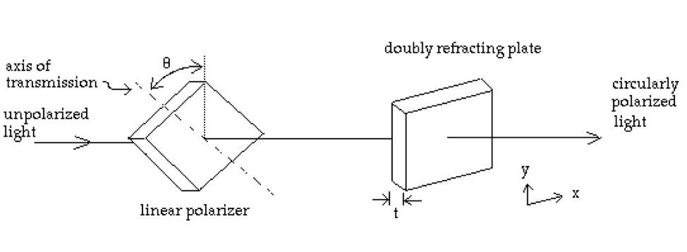

Reading: 
Griffiths, Chapter 9, Sections 1-4  (only through 9.4.2)

You may work together and get help from other students. Your solutions must be written in your own words, without looking at someone else's solutions while
you write them.

Don't forget the 8 points that we are looking for in your solutions (see the peer evaluation checklist for them).

In order to make sure you get your context and meaning/make sense points,
next to your answers, please put a “c” with a circle around it for context,
and an “m” with a circle around it for meaning.
______________________________________________________________________________

1.	The quarter-wave plate:  Some transparent crystals, such as mica or calcite, are doubly refracting; that is, the index of refraction $$n_x$$ in the $$\hat{x}$$   direction is different than the index of refraction $$n_y$$ in the $$\hat{y}$$   direction. By placing a linear polarizer in front of a plate of this material, circularly polarized light can be produced by initially unpolarized light. (See figure at bottom.)
 
	If the light has a frequency $$\omega$$, for what $$\theta$$ and $$t$$ (the thickness of the plate) will the emerging beam be circularly polarized? Does it make a difference in which order the two plates are placed?

2.	Consider a plane-wave vector field, $$\vec{A}$$  , that satisfies the wave equation, i.e. 
$$\vec{A}$$ = $$\vec{A}_0 e^{i(\vec{k}\cdot\vec{r} - \omega t)}$$ . Show that

	i.)	$$\nabla\cdot\vec{A} = i\vec{k}\cdot\vec{A}$$ 

	ii.)	 $$\nabla\times\vec{A} = i\vec{k}\times\vec{A}$$ 

	iii.)	 $$k_x^2 + k_y^2 + k_z^2 = \omega^2/c^2$$.
3.	Suppose the critical angle for total internal reflection is 45°. What is the Brewster angle for 
i.) external reflection and ii) internal reflection?
4.	Griffiths, Problem 9.17. (Please see hints and an answer below!)

We won't start this one in class, but it's still on your homework.  Take at least a half hour to set up the problem by yourself before you talk to classmates, TAs, or Andrea.

5.	Griffiths, Problem 9.20.

{:class="img-responsive"}]

--------------------------------------------------
### Hints

(#1)

You really just need distance = velocity $$\times$$ time.   $$t$$ will be in terms of $$n_x$$ and $$n_y$$, $$\omega$$, and $$c$$. $$\theta$$ will be an actually number of degrees.  

(#3)

The only place your book talks about total internal reflection is in problem 9.39, although
it does do a good job of it. Notice that the only thing that determines that critical angle
is the ratio of the two indices of refraction $$n_2/n_1$$. So knowing the critical angle
is 45$$^\circ$$ wil only get you the ratio of the two indices of refraction. Total
internal reflection only occurs when the light is going from the higher-index medium
into the lower-index medium.  

Total external reflection occurs when the incoming light is at grazing incidence to the interface, and is really important in optics in x-ray telescopes.  In this case the light goes
from the lower index to the higher index.  

What the problem
is asking you is to solve Brewster's angle for going from the higher index to the lower-index medium (the total internal reflection case), and for going from the lower-index medium into the higher one (the total external reflection case.) 
All you need to do for the external reflection
case is invert the ratio of $$n_2/n_1$$.  

(#4)

* I would draw Figure 9.14 again and add the
Electric field on to it.  Since the electric field has to be perpendicular to the plane
of incidence (otherwise known as your piece of paper) I would choose it coming out
of the page in the +y direction.   

Follow the procedure we (hopefully) talked about in class:  
* First, figure out how to write down
what the incident, reflected, and transmitted waves look like.  The polarization direction
is now $$\hat{y}$$ and the propagation direction is arbitrary ($$\vec{k}$$). Writing down
what direction the B-wave points will be the most interesting, because 
it'll be some linear combination of $$\hat{x}$$ and $$\hat{z}$$.
The amplitude of B is still trivially related to E by $$1/v$$.
* Next, use the boundary conditions (9.74) to find the relationships you want.

	
The answer will be this:

$$
\tilde{E}_{0R} = \frac{\cos\theta - \sqrt{n^2 - sin^2\theta}}{\cos\theta + \sqrt{n^2 - sin^2\theta}}\tilde{E}_{0I}
$$

$$
\frac{\tilde{E}_{0T}}{\tilde{E}_{0I}} = 1 + \frac{\tilde{E}_{0R}}{\tilde{E}_{0I}}
$$

where $$n = n_2/n_1$$.  In other words if the first medium is air, $$n$$ is the index
of refraction of the 2nd medium.

You may assume: $$\mu_1 = \mu_2 = \mu_0$$

Notice that you can do the Sketch..., Show...., Confirm...., and Compute.... using the
relationship above.

