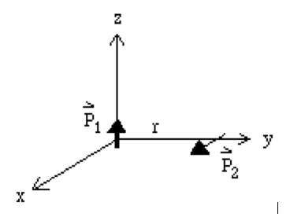

Reading: 
Griffiths, Chapter 4, pages 167 to 196

Unless I say otherwise, you may work together and get help from other students. Your solutions must be written in your own words, without looking at someone else's solutions while
you write them.

Don't forget to finish each problem by writing the main point.

______________________________________________________________________________

1.	Suppose two point dipoles are separated by a distance, $$r$$, as shown in the figure below, i.e. $$\vec{p}_1$$  is in the $$\hat{z}$$ direction and $$\vec{p}_2$$ is in the $$\hat{x}$$ direction.
	(a)	Calculate the energy of the system.
	(b)	What is the torque on 2 due to 1?
	(c)	What is the force on 2 due to 1?

{:class="img-responsive"}

2.	Griffiths, Chapter 4, Problem 4.20.

3.	A linear dielectric sphere of radius $$R$$ with uniform dielectric constant, $$\epsilon$$, is polarized so that $$\vec{P} = \frac{K}{r}\hat{r}$$, where $$K$$ is a constant.

	(a)	Calculate the volume and the surface density of bound charge.

	(b)	Calculate the volume density of free charge in terms of the dielectric constant.

	(c)	Calculate the potential inside and outside the sphere.

	(d)	Sketch a curve of potential versus distance for $$ 0 <\sim  r < \infty$$.

4.	The permittivity of the dielectric between the plates of a parallel plate capacitor varies linearly from one plate to the other. If $$\epsilon_1$$ and $$\epsilon_2$$ are the values at the two plates, where $$\epsilon_2 > \epsilon_1$$ and if the plate separation is $$s$$, show that the capacitance per unit area is
$$
C = \frac{\epsilon_2 - \epsilon_1}{s \ln\left({\epsilon_2/\epsilon_1}\right)}
$$
  
5.	If the space between two long, charged coaxial cylindrical conductors were filled with a dielectric, how would the permittivity have to depend on the distance, $$s$$, from the axis in order that the electric field intensity be independent of $$s$$?

6.	(double credit) A long cylindrical dielectric rod of radius $$R$$ is placed perpendicular to an externally applied, constant electric field, $$E_0\hat{x}$$  . Solve for the potential, both inside and outside the rod. Choose the potential at the center of the cylinder to be $$0$$.  (See assignment #3, problem 5.)

