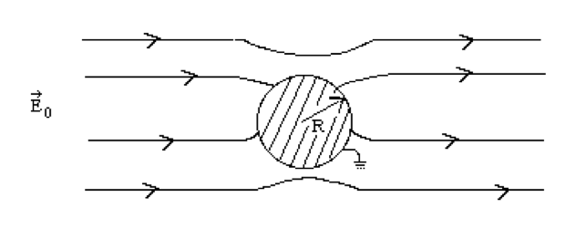

Reading: Griffiths; Chapter 3, sections 3 and 4.

You may work together and get help from other students. Your solutions must be written in your own words, without looking at someone else's solutions while
you write them.

Don't forget the 8 points that we are looking for in your solutions (see the peer evaluation checklist for them).

In order to make sure you get your context and meaning/make sense points,
next to your answers, please put a “c” with a circle around it for context,
and an “m” with a circle around it for meaning.

1.   Griffiths, Chapter 3, Problem 3.16. Replace the question in square brackets with “See if you can come up with a simple way of determining the potential at the center of the cube.”

2.   I'm changing this one to Griffiths, Problem 3.29. If you've already done Problem 3.44 you can submit that, but I think 3.29 gives you way more intuition about how the multipole expansion is used in practice. (Old assignment: Griffiths, Problem 3.44.  Be sure to see my Multipole notes from chapter 3.)

     **The next three questions involve solving Laplace’s Equation in cylindrical coordinates.**

3.   Separate Laplace’s equation in cylindrical coordinates and find three ordinary 
differential equations in $$s$$, $$\phi$$, and $$z$$. (The $$s$$ equation is Bessel’s 
equation and 
solutions to it are called Bessel Functions.) *Note: this is a little trickier 
than in Cartesian Coordinates so be careful!*

4.   Assume that a potential which satisfies Laplace’s equation is independent of the cylindrical coordinate, $$z$$.

     (a) Solve the remaining two equations ($$s$$ and $$\phi$$) in terms of the separation constant. 
     *Hints: Guess a radial function that is a power of $$s$$. Also the separation constant in the $$\phi$$ equation must be negative. Why?*

     (b) Use the fact that you only need a complete set of functions over the interval
$$\phi = 0$$ to $$2\pi$$ to place a condition on the separation constant.  (This is what this part used to say...Use the fact that the angular function must be single-valued to place a condition on the
separation constant.)

     (c) Using parts (a) and (b), write down the general solution of $$v(s, \phi)$$. The terms in the expansion
are called cylindrical harmonics. Note: one must treat the case when the separation
constant is zero as a separate case. You’ll have to go back to the “$$s$$” equation to get a
solution in this case.

We won't start this one in class, but it's still on your homework.  Take at least a half hour to set up the problem by yourself before you talk to classmates, TAs, or Andrea.

5.    Use the expansion in problem 4 to solve the following problem. A long, 
grounded, cylindrical conductor of radius R is placed in an external, initially 
uniform electric field $$\vec{E}_0$$. The direction of  $$\vec{E}_0$$
is perpendicular to the axis of the cylinder. Find the potential at points exterior to the
cylinder, and also find the charge density on the cylinder.

{:class="img-responsive"}

6.    **Extra problem for fun if you want** Suppose a point dipole of strength, $$p$$, 
is placed at the center of a spherical cavity in a grounded conductor.
Solve for the potential everywhere in the cavity. Find
the charge density on the surface of the cavity.

{:class="img-responsive"}
