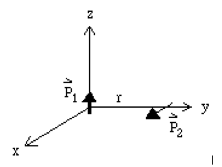

Reading: 
Griffiths, Chapter 4, pages 167 to 196

You may work together and get help from other students. Your solutions must be written in your own words, without looking at someone else's solutions while
you write them.

Don't forget the 8 points that we are looking for in your solutions (see the peer evaluation checklist for them).

In order to make sure you get your context and meaning/make sense points, 
next to your answers, please put a “c”with circle around it for context, 
and an “m” with a circle around it for meaning.

______________________________________________________________________________

{:class="img-responsive"}

1.	Suppose two point dipoles are separated by a distance, $$r$$, as shown in the figure above, i.e. $$\vec{p}_1$$  is in the $$\hat{z}$$ direction and $$\vec{p}_2$$ is in the $$\hat{x}$$ direction.
	(a)	Calculate the energy of the system.
	(b)	What is the torque on 2 due to 1?
	(c)	What is the force on 2 due to 1?

2.	Griffiths, Chapter 4, Problem 4.20.

3.	A linear dielectric sphere of radius $$R$$ with uniform dielectric constant, $$\epsilon_r$$, is polarized so that $$\vec{P} = \frac{K}{r}\hat{r}$$, where $$K$$ is a constant.

	(a)	Calculate the volume and the surface density of bound charge.

	(b)	Calculate the volume density of free charge in terms of the dielectric constant.

	(c)	Calculate the potential inside and outside the sphere.

	(d)	Sketch a curve of potential versus distance for $$ 0 <\sim  r < \infty$$.

4.	The permittivity of the dielectric between the plates of a parallel plate capacitor varies linearly from one plate to the other. If $$\epsilon_1$$ and $$\epsilon_2$$ are the values at the two plates, where $$\epsilon_2 > \epsilon_1$$ and if the plate separation is $$s$$, show that the capacitance per unit area is
$$
C = \frac{\epsilon_2 - \epsilon_1}{s \ln\left({\epsilon_2/\epsilon_1}\right)}
$$

We won't start this one in class, but it's still on your homework.  Take at least a half hour to set up the problem by yourself before you talk to classmates, TAs, or Andrea.

5.	If the space between two long, charged coaxial cylindrical conductors were filled with a dielectric, how would the permittivity have to depend on the distance, $$s$$, from the axis in order that the electric field intensity be independent of $$s$$?

