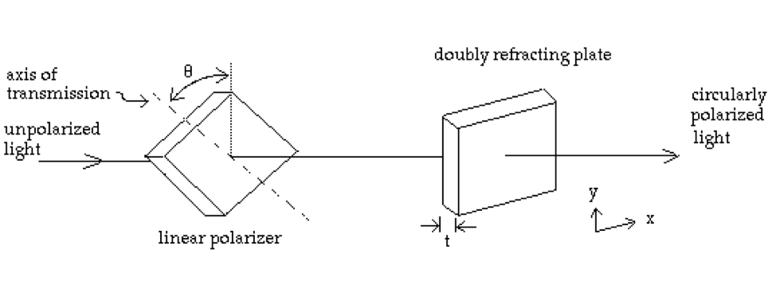

Reading: 
Griffiths, Chapter 9, Sections 1-4  (only through 9.4.2)

Unless I say otherwise, you may work together and get help from other students. Your solutions must be written in your own words, without looking at someone else's solutions while
you write them.

Don't forget to finish each problem by writing the main point.

______________________________________________________________________________

1.	The quarter-wave plate:  Some transparent crystals, such as mica or calcite, are doubly refracting; that is, the index of refraction $$n_x$$ in the $$\hat{x}$$   direction is different than the index of refraction $$n_y$$ in the $$\hat{y}$$   direction. By placing a linear polarizer in front of a plate of this material, circularly polarized light can be produced by initially unpolarized light. (See figure at bottom.)
 
	If the light has a frequency $$\omega$$, for what $$\theta$$ and $$t$$ (the thickness of the plate) will the emerging beam be circularly polarized? Does it make a difference in which order the two plates are placed?

2.	Consider a plane-wave vector field, $$\vec{A}$$  , that satisfies the wave equation, i.e. 
$$\vec{A}$$ = $$\vec{A}_0 e^{i(\vec{k}\cdot\vec{r} - \omega t)}$$ . Show that

	i.)	$$\nabla\cdot\vec{A} = i\vec{k}\cdot\vec{A}$$ 

	 ii.)	 $$\nabla\times\vec{A} = i\vec{k}\times\vec{A}$$ 

	iii.)	 $$k_x^2 + k_y^2 + k_z^2 = \omega^2/c^2$$.
3.	Suppose the critical angle for total internal reflection is 45°. What is the Brewster angle for 
i.) external reflection and ii) internal reflection?
4.	Griffiths, Problem 9.17.
5.	Griffiths, Problem 9.20.

{:class="img-responsive"}]
