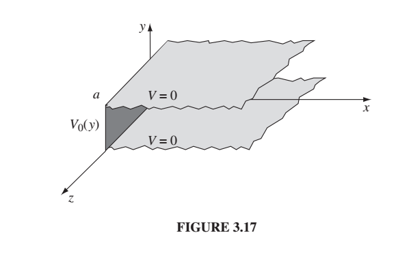
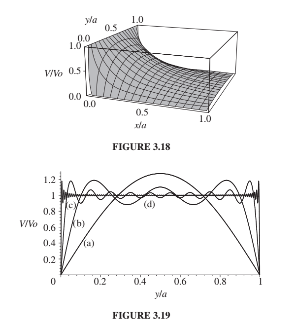

**Question to start out class**
Draw the example below. What do you think the potential looks like inside the box?  And could you write down a guess for what it looked like?

A quote from Griffiths because sometimes I just can't say it any better:

**In this section we shall attack Laplace’s equation directly, using the method of  separation of variables, which is the physicist’s favorite tool for solving partial differential equations. The method is applicable in circumstances where the  potential (V) or the charge density (σ) is specified on the boundaries of some  region, and we are asked to find the potential in the interior. The basic strategy is  very simple: We look for solutions that are products of functions, each of which  depends on only one of the coordinates.**

Griffiths, David J.. Introduction to Electrodynamics (p. 130). Cambridge University Press. Kindle Edition. 

So for example, your first homework problem for next week is a cube with the top
side held at $$V_0$$ and the other 5 sides are grounded.  Find the potential everywhere.

If the top and bottom were infinite, then we'd just have Laplace's equation in 1 dimension
and we solved that last week.  The potential would have value $$V_0 \frac{z}{a}$$ where
$$z$$ was the distance above the bottom plate.  But that's not true here because we've
got these sides held at $$0$$ potential. So we try to come up with a potential that
satisfies Laplace's equation that is the product of two functions that are only functions
of one variable. 

Can you guess what it's going to be? You know the potential this way has to be increasing (up), and you know the potential across has to be 0 on this side and 0 on this side, and something non-zero in the middle.  Got any guesses?

Let's do a different problem and then come back to that one. (Figure below from Griffiths.)

{:class="img-responsive"}

Laplace's equation in 2-dimensions:

$$
\nabla^2 V =  \frac{\partial^2V}{\partial x^2} + \frac{\partial^2V}{\partial y^2} = 0
$$

Here's what we mean by looking for solutions that are products of two functions, each of
which is only a function of one variable:

$$
V(x,y) = X(x)Y(y)
$$

So if that's what we're assuming, let's find out what we know about those functions:

$$
\nabla V = \frac{dX}{dx}Y \hat{x} + \frac{dY}{dy}X \hat{y}  
$$

where I used the chain rule to do the derivatives of the products and used the
fact that, e.g. $$dY/dx = 0$$.

Now take the divergence of the gradient (reminder: that's what $$\nabla^2$$ is:

$$
\nabla \cdot \nabla V = \frac{d^2X}{dx^2}Y  + \frac{d^2Y}{dy^2}X   
$$

By Laplace's equation, this is equal to 0.

And now we'd like to `separate' the variables, i.e. make it so that each term only
depends on one variable. Divide by $$XY$$:

$$
\frac{1}{X}\frac{d^2X}{dx^2} + \frac{1}{Y}\frac{d^2Y}{dy^2}  = 0
$$

Are they both zero?  No, but they both have to be constant and they both have to
be equal and opposite constants so that they add to zero. If they're not constant
then somehow the $$X$$-term depends upon $$y$$ so that they know how to cancel out, but
we said that's not true. 

So let's set them equal to opposite constants.  For convenience and because I can
see the future let's set them equal to $$k^2$$ and $$-k^2$$.  (Are you getting flashbacks
of previous classes yet?)

If 
$$
\frac{1}{X}\frac{d^2}{dx^2}=k^2 
$$
then
$$
\frac{d^2X}{dx^2}=k^2X 
$$

If
$$
\frac{1}{Y}\frac{d^2Y}{dy^2} = -k^2 
$$
then
$$
\frac{d^2Y}{dy^2} = -k^2Y 
$$

One of them looks like a sinusoid and one looks like a decaying exponential. Did we guess
which one was which? Looking at the figure $$X$$ looks like it should be a decaying exponential, and $$Y$$ looks like it should be a sinusoid. Do you see why?  Then we can get it
to be zero on both boundaries. 

So yes, I did guess right!

So now we know the basic form of both $$X$$ and $$Y$$:

$$
X = Ae^{kx} + Be^{-kx}\\
Y = C\sin{ky} + D\cos{ky}
$$

And we know a little bit more than that by looking at our boundary conditions.
$$X$$ has to be non-zero at $$x=0$$ and then go to 0 at $$x= \infty$$, so it
must be $$e^{-kx}$$.  So $$A=0$$.

Similarly we need $$Y$$ to be zero at $$0$$ and $$a$$ and the $$\sin$$ is the one that
is zero at 0, so we must have $$D=0$$.

So our potential is of the form:

$$
V = XY = Be^{-kx}C\sin{ky}
$$

and we don't need the two constants anymore.  Let's call them all $$C$$ because Griffiths does.

$$
V = Ce^{-kx}\sin{ky}
$$

We haven't used all our boundary conditions yet, though. Remember the two $$k$$'s really
do have the be the same, because they have to cancel out and gives us 0 in Laplace's equation.

$$\sin{0} = 0$$ but we also need $$\sin{ka}=0$$ so $$ka$$ must be a multiple of $$\pi$$.

$$
ka = n\pi\
{\rm then} \
k = n\pi/a
$$

where $$n$$ can be $${1,2,3,4....}$$

So we've narrowed this down a LOT but not all the way.  We know it looks like this

$$
V {~\rm looks~ kinda~ like~}  C e^{-n\pi x /a} \sin{\frac{n\pi y}{a}}
$$

Where $$n$$ could be any of those values (1,2,3,4..), and $$C$$ could be different for each of them,
so the most general solution is an arbitrary sum of them.

$$
V = \sum_1^\infty C_n e^{-n\pi x /a} \sin{\frac{n\pi y}{a}}
$$

This is almost the solution.

Let's figure out where we are...

So this satisfies Laplace's equation everywhere.  We arranged that it would.  Remember?
Because the derivative with respect to $$x$$ gives us $$k^2$$ and the derivative
with respect to $$y$$ gives us $$-k^2$$ so 

$$
\nabla^2 = \frac{\partial^2 V}{\partial x^2} + \frac{\partial^2 V}{\partial y^2}
$$

$$
\nabla^2 = -k^2 + k^2 = 0
$$

(where $$k = n\pi/a$$.) So Laplace's equation is satisfied everywhere.
(This is part of the answer to Anthony's question.  Notice Laplace's equation is satisfied
everywhere!! Now we need one where there's a charge in the region so we can
deal with that... We'll get there but not today.)

Okay but how do we get the rest of the solution, and what is the rest of the solution?
We still have one boundary condition we haven't satisfied - that the potential is $$V_0$$
on the left boundary (at $$x=0$$0).  And we still don't know what the $$C_n$$'s are. (So we have the solution except for the infinite number of constants we don't know...hah!)

We use the boundary condition $$V=0$$ at $$x=0$$ and what Griffiths calls "Fourier's trick" to figure out what the $$C_n$$'s are.

First here's the solution at $$x=0$$:

$$
V_0 = \sum_1^\infty C_n \sin{\frac{n\pi y}{a}}
$$

We'd really like to solve for $$C_n$$. To do that we
multiply both sides by sin(n^\prime \pi y/a) and integrate from $$0$$ to $$a$$.
*Why?  Because the sine function is orthogonal to itself as long as you integrate
over an integer number of cycles (or infinity works too).  Also, conveniently, $$V_0$$
is only defined over the region 0 to a. *

$$
\int_0^a V_0 \sin{\frac{n^\prime\pi y}{a}}dy = \sum_1^\infty C_n \int_0^a sin\frac{n^\prime \pi y}{a}\sin{\frac{n\pi y}{a}}dy
$$

The integral on the right is $$0$$ if $$n^\prime \ne n$$ and is $$a/2$$ if $$n^\prime = n$$.

So now the only pieces of the infinite sum we keep are the ones where $$n^\prime = n$$.
We have

$$
\int_0^a V_0 \sin{\frac{n^\prime\pi y}{a}}dy = C_{n^\prime} \frac{a}{2}
$$

We can take away the primes...

$$
\int_0^aV_0 \sin{\frac{n\pi y}{a}}dy = C_n \frac{a}{2}
$$

or

$$
C_n=\frac{2}{a}\int_0^a V_0\sin{\frac{n\pi y}{a}} 
$$

I didn't write it this way, but all of this is true for $$V_0$$ being a constant
OR some function of $$y$$.   Your book actually calculates out what that looks like
for a constant $$V_0$$.  $$C_n$$ is zero if $$n$$ is even, and $$\frac{4V_0}{n\pi}$$ if
$$n$$ is odd.

So we have the $$C_n$$'s and we have our solution that's the sum over them:

$$
V = \sum_{1,3,5..}^\infty \frac{4V_0}{n\pi} e^{-n\pi x /a} \sin{\frac{n\pi y}{a}}
$$

(You can take the $$\frac{4V_0}{\pi}$$ out of the sum if you want.)  Notice that leaves
$$1/n$$ in the sum.  So each term gets less important as the frequency of the sinusoid
gets higher.  

The claim in the bottom figure is that they're showing you the first term of the potential,
then the first 5, then the first 10, and then the first 100. I don't think that's what it is.
Someone should put it into mathematica and see (and then I can use your figure!).
I suspect a is the first term.  b is terms 2-5, c is terms 6-10, and d is terms 11-100.  Something like that.

{:class="img-responsive"}

Okay so now let's look back at the problem I gave you at the beginning of class.  Talk with your neighbor and sketch out a plan for doing it.

# Separation of Variables in Spherical Coordinates
Separation of Variables in Spherical Coordinates leads to the 
Legendre Polynomials, so I have put that with the next lecture "Multipole
Expansion (and Legendre Polynomials)"
