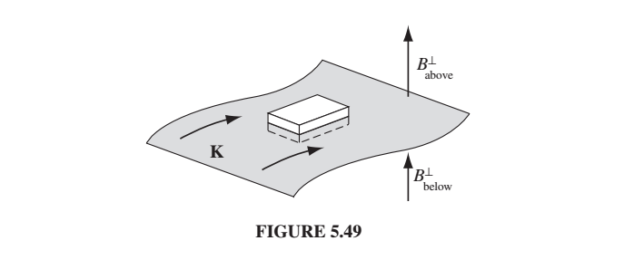

## Where we were last time
We did this cool problem where we figured out that for two wires to
balance the electric and magnetic forces as they were traveling through
space, they'd have to be going the speed of light. Some things to remind
you about that and/or to notice
about that (some of them we talked about last time and some we didn't):
* Light travels at the speed where the wave works.  The only speed
at which the wave can reproduce itself indefinity is $$c$$.
* The situation we were doing is really not a wave.  It's not reproducing
itself.  We somehow have to get the wire traveling at the speed of
light for it to work.  So it's not a self-propagating situation.
* The situation we looked at yesterday has many of the same properties as
a wave, which is why it worked.  The E-field, the B-field, and the velocity
were all perpendicular to each other. 
* In contrast to a wave, our situation had charges and we dealt with the 
forces on those charges.  You'll notice maxwell's
equations (when we review them today) don't say anything about forces on charges. Rather, Maxwell's equations tell you how charges produce E and B fields, but
they don't include the forces on them.
* cB has the same units as E
* In order for the magnetic force to balance the electric force, we had
to be going at the speed of light.  From this we can conclude that electric
forces are usually much bigger than magnetic forces.
* Also, usually the lines of current would be uncharged, and the electric
force would be zero.  So in general, the two wires running parallel will
attract each other.

## Where we're going today
* Ampere's Law $$ \oint \vec{B}\cdot d\vec{l} = \mu_0 I_{enc} $$
* Review of Maxwell's equations
* Vector Potential  $$\vec{B} = \nabla \times \vec{A}$$
Comment about vector potential:  it's not quite as useful NOW as the
scalar potential is.  It doesn't make your life easy as often.  However,
we need both potentials in order to deal with radiation, which is where we're 
going. Short version: above we said that an EM wave is a situation where
the E and B fields will propagate themselves into space.  We haven't
said how we create the waves in the first place. We'll need moving 
charges to create the radiation in the first place, and we'll use 
the potentials to calculate it.

You'll notice as we're reviewing magnetic fields we sort of accidentally
review a lot about electric fields.  So the study of magnetic fields may
give you some perspective on electric fields.

Let's start, as we did with Electric fields, by looking at the
## Curl and Divergence of $$\vec{B}$$
Your book has two different sections on this.  One uses straight-line
currents and the other uses more general currents.  We'll do the 
straight-line currents section now and I'll leave the general current
discussion to your reading.

Last time we used the formula for field around a straight wire that
comes from the Biot-Savart law

$$
B = \frac{\mu_0 I}{2\pi s}
$$

We can use this to compute the closed-line integral of B around a circular
path around a straight-line current $$I$$ of radius $$s$$..

$$
\oint \vec{B}\cdot d\vec{l} = \oint \frac{\mu_0 I}{2\pi s} dl
$$

$$
 = \frac{\mu_0 I}{2\pi s} \oint dl
$$

But $$\oint dl$$ is just $$2\pi s$$ so now we have

$$
\oint \vec{B}\cdot d\vec{l} = \mu_0 I
$$

Notice that the integral is independent of the radius $$s$$.  It would
be true for any radius. And in fact, it would be true for any path!!
It's a general result for the line integral of B.
Any closed loop you draw in space, no matter what shape, the integral
of B around it is $$\mu_0$$ times the current enclosed.

That's Ampere's law...

$$
\oint \vec{B}\cdot d\vec{l} = \mu_0 I_{enc}
$$

Compare to Gauss' law...

$$
\oint \vec{E} \cdot d\vec{a} = \frac{1}{\epsilon_0} Q_{_{\rm enc}}
$$

In one case it's the current enclosed, and the other case it's the charge
enclosed.  It makes sense that the the current version would be a line
rather than an area, because you can enclose a current in an area, because
it has to flow. 

Just like in Gauss' Law, Ampere's is only useful for *calculating* the
field if you've got a symmetric situation where $$\vec{B}$$ is 
constant all around the loop you choose.  So just like in Gauss' law
you need to pick your loop carefully.

Most often you will have a current $$I$$ in a wire, but sometimes you
need to deal with more general flow of current across an area and then
you need

$$
I_{enc} = \int\vec{J}\cdot d\vec{a}
$$

Putting it all together we have...

$$
\oint \vec{B}\cdot d\vec{l} =  \int\vec{J}\cdot d\vec{a}
$$

We can use the curl theorem on the left side (in the opposite direction we
usually use it) to get...

$$
\int(\nabla \times \vec{B})\cdot d\vec{a} = \mu_0 \int \vec{J}\cdot d\vec{a}
$$

So now we have

$$
\nabla \times \vec{B} = \mu_0 \vec{J}
$$

which is the differential form of Ampere's law, and usually how we write
it in Maxwell's equations.

Section 5.3.2 in your book derives this rigorously (this was more motivational) and also derives the divergence of B, which is zero

$$
\nabla \cdot \vec{B} = 0
$$

## Maxwell's equations
So now let's compare Maxwell's equations for E and B (in a static
situation so I've left out all the time derivative terms):

Gauss' Law

$$
\nabla \cdot \vec{E} = \frac{1}{\epsilon_0} \rho
$$

(If this has the $$\frac{\partial\vec{B}}{\partial t}$$ term in it
we call it Faraday's Law)

$$
\nabla \times \vec{E} = 0
$$

(no name)

$$
\nabla \cdot \vec{B} = 0
$$

Ampere's Law
$$
\nabla \times \vec{B} = \mu_0 \vec{J} 
$$

The two electric field laws are equivalent to Coulomb's law plus boundary
condition that E has to be zero if you're far away from all charges.

The two magnetic field laws are equivalent to the Biot-Savart law plus
the boundary condition the B has to be zero far away from all currents.

The statement that the divergence of E is proportional to the charge density
is the same as saying that E-field lines start on positive charges.
The statement that the divergence of B is zero says that B field lines
don't start anywhere.  Rather they curl around currents, which is what
the curl equation says. 

Another way of saying that is that there aren't any point sources of
B.  There are no magnetic monopoles.  It takes a moving charge to make
a magnetic field, and it requires a moving charge for the magnetic
field to exert force on the charge. 

## The vector potential
You may remember that the only reason we were able to write E as
the gradient of the potential was that the curl of E is zero.
(Because the curl of a gradient is always zero.)

In this case, the curl of B is NOT zero, so we can't write B as the
gradient of a scalar potential.  However, because the divergence
of B is zero, we can write it as the curl of a vector potential:

$$
\vec{B} = \nabla \times \vec{A} 
$$

Remember the divergence of a curl is zero, so if the divergence of
a B was not zero, then we wouldn't be able to write it as the curl of some
vector.

Is there a Poisson's equation for $$\vec{A}$$?  Absolutely.  Let's take
Ampere's law...

$$
\nabla \times \vec{B} = \mu_0 \vec{J} 
$$

and replace B with the curl of A.

$$
\nabla \times (\nabla \times \vec{A}) = \mu_0 \vec{J} 
$$

We need a vector identity:

$$
\nabla (\nabla \cdot \vec{A}) - \nabla^2 \vec{A} = \mu_0 \vec{J} 
$$

We actually are at liberty to choose $$\nabla \cdot \vec{A} = 0$$.
The curl of it has to be B, but there's no specification on its divergence.
This is actually analogous to our saying that we could add a constant
to the scalar potential $$V$$ and it wouldn't change the E-field.

So then we have:

$$
\nabla^2 \vec{A} = -\mu_0 \vec{J} 
$$

Poisson's equation!  So yes, you can do boundary value problems with
B just like we did for E.

Note this is really three equations, one for each component of $$\vec{A}$$.

$$Eq. (7) and the “vector potential” W(r) by Eq. (8).
Furthermore, the potentials themselves are unique if they vanish as r → ∞ and W is
in a gauge where ∇ · W = 0.

## Boundary conditions 
I think you should guess the boundary conditions.  What do you
think they are?

Here are the two E-field boundary conditions that you can find
analogies to:
* V is continuous everywhere (because it's the integral of something)
* E_parallel is continuous across surface charge
* E_perp is discontinuous across surface charge (as below)

$$
\vec{E}_{above} - \vec{E}_{below} = \frac{\sigma}{\epsilon_0} \hat{n}
$$

(Reminder if "below" was inside a conductor than $$\vec{E}_{below}$$
is 0 and the expression above reduces to a more familiar one for
the relationship between E and rho on a conductor.)

### For the magnetic field and its associated vector potential...
* A is continuous
* B perp is continuous!! 
* B parallel is discontinuous

Let's look at how we get that formally, though, because I think it's really
useful to see how it related to Maxwell's equations.  The boundary conditions
are a direct result of Maxwell's equations.

We use the integral form of (B field is divergenceless) 
$$
\nabla \cdot \vec{B} = 0
$$

We apply the divergence theorem... (shown below for an arbitrary vector T)

$$
\int_V (\nabla \cdot \vec{T})d\tau = \oint_S \vec{T}\cdot d\vec{a}
$$

to get...

$$
\oint\vec{B}\cdot d\vec{a} = 0
$$

And then we can draw a little pillbox like we did before for E...

{:class="img-responsive"}

And only the component of B that is perpendicular to the top and bottom
surface of the box will contribute, so we'll get $$B_{\perp, top}$$ times
the area minus.....etc.

E is not divergenceless so the right side of that equation wasn't
zero when we did this before, and there was a discontinuity in E across the boundary.
Now, however, B is divergenceless, so now we get:

$$
B_{above}^\perp = B_{below}^\perp
$$

Punchline: The $$B_\perp$$ boundary condition comes from the rule about no
magnetic monopoles, i.e. $$\nabla \cdot \vec{B} = 0$$.

To get the rule about the tangential components of $$\vec{B}$$, we need the 
integral version of Ampere's law:

$$
\oint \vec{B}\cdot d\vec{l} = \mu_0 I_{enc}
$$

We run an Amperian loop perpedicular to the surface current....

{:class="img-responsive"}

$$
\oint \vec{B}\cdot d\vec{l} = (B_{above}^\|| - B_{below}^\||)l = \mu_0 I_{enc} = \mu_0 K l
$$

where $$\vec{K}$$ is the surface current.  (Current per area, so surface charge
density times velocity).

### End Note about the vanishing vector potential and Helmholtz Theorem
In 2020 we got into an interesting discussion about whether we could count
on $$\vec{A}$$ to vanish at infinity. $$V$$ is only known to a additive
constant, and so we can choose $$V$$ to be zero at infinity.  $$\vec{A}$$
however, is known only to an additive vector whose gradient is zero (because
the curl of a gradient is zero).  And
we choose the ``gauge" where $$\nabla \cdot \vec{A} = 0$$.  

Does this give us enough freedom to choose $$\vec{A}$$ to vanish at
infinity.....?

It looks like it does.  If you look at examples 5.11 and 5.12 in the book, you'll
see that both of those solutions for $$\vec{A}$$ vanish at infinity.

Here's Helmholtz Theorem in case it helps answer this question:
If the divergence D(r) and curl C(r) of a vector function F(r) are specified, and if
they both go to zero faster than $$1/r^2$$ as $$r \to \infty$$ , and if F(r) itself tends to zero as
$$r \to \infty$$, then F(r) is uniquely given by 

$$
F = −\nabla U + \nabla \times W,
$$

in U(r) is the scalar potential and W is the vector potential.
