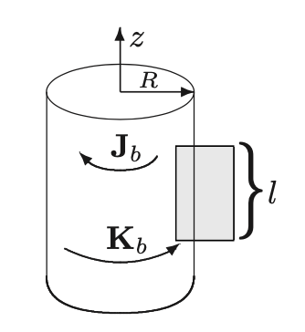
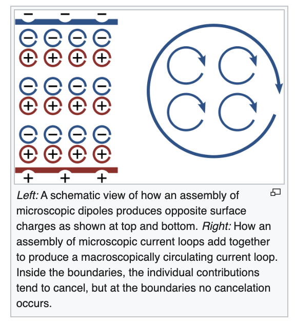

### Last time (before break):

#### The "Gilbert" model:

You can do a lot of magnetostatic problems by using electrostatic results
and replacing:
* $$\vec{p}$$ with $$\vec{m}$$
* $$1/\epsilon_0$$ with $$\mu_0$$
* $$E$$ with $$B$$

Once you get really close-up to the dipole (where it looks like a ring
of current instead of a perfect magnetic dipole) then this breaks down.
Griffiths' advice is to use the Gilbert model to get intuition, but
don't rely on it for quantitative results.

#### Paramagnetism

A magnetic field will polarize matter.  It will change its magnetic moment by:

$$
\Delta \vec{m} = -\frac{e^2R^2}{4m_e}\vec{B}
$$

where $$R$$ is the radius of the "orbit" of the electron.

Notice the change in $$\vec{m}$$ is opposite the direction of $$\vec{B}$$.

$$\vec{M}$$ is the magnetic dipole moment per unit volume (just like $$\vec{P}$$
is the electric dipole moment per unit volume.)

In polarized matter we calculated a bound charge (both volume and surface.)  In the same
way for magnetized matter we can calculate bound current (both volume and surface.)

The idea of bound current and bound charge give you a way
to think about why the field is changed by the material, but it's
not a good way to calculate the field (not usually, anyway).

### Today - Auxiliary Field

Today Dave is going to tell you about the auxilliary field
$$H$$ which is the better way to calculate the field in magnetized
matter.

### The Auxiliary Field

Just like we did with electric charge, we can do with current.  To calculate
the magnetic field we can consider the free current density $$\vec{J}_f$$
and the bound current density $$\vec{J}_b$$.  The bound current
density is really sort of an "effective" current density due to all
the electronic orbits in the matter.  For the sake of calculating
the electric field, you need to consider it.

$$
\vec{J} = \vec{J}_b + \vec{J}_f
$$

Griffiths makes the point here that this is NO NEW physics.    It's
really just saying "Magnetization effectively adds current, and you
have to include that current when you're calculating the field."

So then we can use Ampere's law as before:

$$
\frac{1}{\mu_0} (\nabla \times \vec{B}) = \vec{J}_b + \vec{J}_f = \vec{J}_f + (\nabla \times \vec{M})
$$

As we did with electric fields we bring all the $$\nabla$$'s over
to one side...

$$
\nabla \times \left( \frac{1}{\mu_0} \vec{B} - \vec{M}\right) = \vec{J}_f
$$

And you know (from what we did with $$\vec{E}$$ and $$\vec{D}$$ that I'm
about to tell you that the thing in parentheses is $$\vec{H}$$, but before
we say that, let's remind ourselves what we just did...

The $$\vec{B}$$ in the equation just above is the **TOTAL** $$\vec{B}$$, due
to the free current and the bound current added together.  We subtract
off the piece due to the magnetization.
What's left is the piece that's due to the
free current.  So what I'm about to call $$\vec{H}$$ is really the field
** NOWHERE**.  It's not a physical quantity.  It's just way more useful for
doing problems than calculating bound currents.

Having said all that I will say:

$$
\vec{H} = \frac{1}{\mu_0} \vec{B} - \vec{M}
$$

and Ampere's law now reads:

$$
\nabla \times \vec{H} = \vec{J}_f
$$

or in integral form:

$$
\oint \vec{H}\cdot d\vec{l} = I_{free}
$$

### Caveat to my going on and on about how $$\vec{H}$$ is not a physical quantity

I still stand by my statement.  However, Griffiths has a really interesting
paragraph (pg 281-282) about how useful $$\vec{H}$$ is in the lab.   It's
useful because free current is actually the thing you can measure and control,
so $$\vec{H}$$ is the thing you can control (even though it doesn't exist.)

Let's do a problem with it:

##### Problem 6.12b in the book:
An infinitely long cylinder, of radius $$R$$, carries a "frozen-in" magnetization,
parallel to the axis,

$$
M = ks \hat{z}
$$

where $$k$$ is a constant and $$s$$ is the distance from the axis. There is no
free current anywhere. Find the magnetic field inside and outside the cylinder.
(Use Ampere's law to find $$\vec{H}$$, and then get $$\vec{B}$$.)

Reminder: the magnetic field outside a solenoid is zero, and points completely
along the axis of the solenoid.  Its direction is given by the right-hand-rule.

(Please suggest that they work on this in their usual working groups.  They will
use all the board space.  While they're working, you should walk around and give
hints.  If you see someone calculating J or K, gently suggest that H gives you
a way of avoiding that completely, which is the point of this exercise.)

Answer:

Use the Amperian loop shown (shaded) in the figure.

If you sketch this figure on the board, leave out the J and K, because their
directions should be a surprise.
{:class="img-responsive"}

By symmetry, H points in the z direction. Integrating around the Amperian loop gives 

$$
\oint \vec{H}\cdot d\vec{l} = Hl =I_{free, enc}  = 0
$$

since there is no free current there. 

So $$\vec{H}=0$$,and hence $$\vec{B}=\mu_0\vec{M}$$. Outside $$M=0$$,so  $$B=0$$;
inside $$M=ks\hat{z}$$, so $$\vec{B} = \mu_0 ks\hat{z}$$.

What's your intuition here for what's happening?

Ans: 

Now I want you to actually calculate the bound current to see if it helps
you figure out what is happening.

Ans:

$$
\vec{J}_b =\nabla \times \vec{M} =−k\hat{\phi}
$$

$$
\vec{K}_b =\vec{M}\times \hat{n} =kR\hat{\phi}.
$$

The wikipedia page on Maxwell's Equations is shockingly useful:
Here's a figure from it:

{:class="img-responsive"}

I think this cartoon does a good job of explaining the direction of the surface
current, $$\vec{K}$$ which is in the same direction (by the right-hand
rule) as the magnetization.

How do you explain the volume current going in the opposite direction????
I think I can explain it by virtue of the magnetization increasing with
$$s$$.  You can expect the little current loops to cancel out completely
if one is bigger than the other.  And if the inner one is smaller than the 
outer one then the part that ends up not cancelling will be going in the opposite
direction as the current loops.

#### Boundary Conditions
(I don't actually think we'll get a chance to talk about these in class, but
I put them here for reference.)

The boundary conditions on $$\vec{H}$$ are:

$$
H_{above}^\perp - H_{below}^\perp = M_{above}^\perp - M_{below}^\perp  
$$

$$
\vec{H}_{above}^\| - \vec{H}_{below}^\| = \vec{K}_f \times \hat{n}
$$

(Notice that the perpendicular boundary conditions are not vectors, because
$$\vec{H}_\perp$$ is only one direction, but $$\vec{H}_\|$$ is a vector in two dimensions.)
