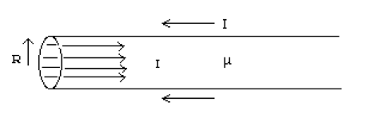

[A pdf of the exam is available here.](finalexam.pdf)

This exam is due at noon on Friday May 15.

Instructions: 
You may choose 3 contiguous hours to work on this exam.  You may use your notes, the book, and anything found at andrealommen.github.io/PHY309.  If you wish to take a 15-minute break during the exam (which I recommend) you may then take 3 hours and 15 minutes to work on the exam.

You may use Mathematica if you wish but you must follow the rules for making it readable.

If you can't complete a problem, please make as much progress as you can, and in 
all cases provide all the
work you were able to do.  This will ensure that I get as much information about
your thought process as possible. You know me - I love giving credit for great thinking. 

Please scan your answers and submit them to the dropbox folder I will make available.  Do NOT count your time scanning and submitting as part of the 3 hours.

There are 4 problems.  

Please email me when you are starting the exam.

(You may either print this out or write this statement on your exam and sign
it.)

I accept full responsibility under the Haverford College Honor System for my conduct on the examination.

Signed____________________________________________________________________

----------------------Exam Begins Here------------------------------

1.	A dielectric sphere of radius R and permittivity $$\epsilon$$ has an imbedded free charge distribution of $$\rho = \rho_0\left(1 - \frac{r^2}{R^2}\right)$$.
 
	(a)	Calculate the total free charge, $$Q$$, of this distribution.

	(b)	Find the electric field, $$\vec{E}$$ , everywhere.

	(c)	What is the value of the potential at $$r = 0$$? (Assuming the potential is zero at infinity.) If youdid not get an answer for part (b) you may do parts (c) and (d) by assuming something for the
electric field that depends upon $$\rho_0$$, $$r$$, $$R$$, and $$\epsilon$$.  It should have the correct units
and the correct $$r$$ dependence.  Likewise, assume something for the E-field inside the sphere.  (What
dependence on $$r$$ do you expect $$E_{out}$$ and $$E_{in}$$ to have?)

	(d)	What are the bound charge density and bound surface charge density?

2.	A long cable with magnetic permeability, $$\mu$$, carries current in one direction uniformly distributed over its cross section which is circular with radius $$R$$. The current returns along the surface (there is a very thin insulating sheath separating the currents). (See Figure at the bottom of the page.)
 
	(a)	Solve for the magnetic field,   (magnitude and direction), at a distance $$r$$ from the center of the cable (both for $$r > R$$ and $$r < R$$).

	(b)	Solve for the energy stored per unit length in the magnetic field.

	(c)	What is the inductance per unit length of this cable?

	(d)	What are the bound current density and bound surface current density?

 
3. 	You create a dipole antenna out of a 10cm-long (unfolded length) paperclip with 1m$$\Omega$$ of resistance. You bend it into a circle with a 0.5 cm gap between the two ends.  You attach each end to a signal generator (one end to the signal, and the other end to the ground).  You choose a 5-Volt sinusoidal current with a frequency of 1MHz ($$V = V_0\cos \omega t$$ where $$V_0 = 5 Volts$$).  Despite the gap between the two ends, this is an excellent approximation to a magnetic dipole antenna and you should treat it as such (so the magnetic moment is the current times the area of
the circle.)

	(a) 	What's the intensity radiated as a function of angle $$\theta$$ away from the axis of the circle and
distance $$r$$ away from the dipole?

	(b) 	What's the total power radiated from the dipole?  By what factor will the power increase if you double the frequency to 2Mhz?

4. 	Suppose an infinitely long straight wire carries a sudden burst of current:  $$I(t) = q_0\delta(t)$$.  You intend to calculate the vector potential
a distance $$s$$ away from the wire.   You should assume that $$I(t) = q_0\delta(t)$$ is true everywhere in the wire.

	(a) Will the vector potential be:

		(i) Non-zero only at t=0?

		(ii) Non-zero only at t= s/c?

		(iii) Zero up until t = s/c and then non-zero after that?

		Please justify your answer with very specific words or with math.

	(b) Set up the integral to calculate the vector potential $$\vec{A}(s,t)$$.  You will find you have both $$\mathscr{r}$$ and $$s$$ in your 
integral. Express one of them in terms of one or the other, so that you only
have one or the other in your integral.  Make sure the limits are appropriate to what you're integrating over.  In other words, thought I'm not 
actually asking you to do this integral, you're supposed to set it up so 
that you could. Someone (you, if you want to!) could plug your integral 
into Mathematica and get $$\vec{A}(s,t)$$ without doing anything more. 

Here's the figure for problem #2.
{:class="img-responsive"}
