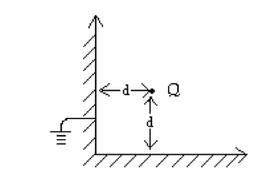
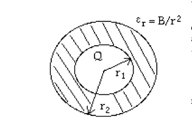
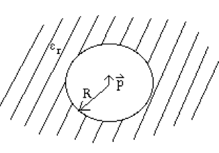

[Click here for a pdf of this page](firstexam.pdf)

The exam will be available on this page at noon on Tuesday, March 3rd, and will be due at 4pm on
Friday, March 6th.

Instructions: 
You may choose 3 contiguous hours to work on this exam.  You may use your notes, the book, and anything found at andrealommen.github.io/PHY309.  If you wish to take a 15-minute break during the exam (which I recommend) you may then take 3 hours and 15 minutes to work on the exam.

I have some extra office hours listed on the "Help!" tab of the web page.

You may use Mathematica if you wish but you must follow the rules for making it readable.

**Please print this sheet, sign it, and staple it to the front of your exam. I'm going to turn the sheet to the back and grade your exam without looking at your name, so please only write your SID on the sheets with your work on them.**

**Please write your answers on paper (or print them), staple them with the problems in order 1 to 4, signed cover sheet on top, and place the completed exam
in the lock box by my office L108 in the KINSC.**

There are 4 problems.  

Please email me when you are starting the exam.

I accept full responsibility under the Haverford College Honor System for my conduct on the examination.

Signed____________________________________________________________________

Exam begins here:
-----------------------------------------------------------------------------

1.	(5 points)
	Suppose that in cylindrical coordinates the potential, $$V$$, is everywhere represented by 
$$V(s,\phi,z) = As$$, where $$A$$ is a constant. Which of the following charge densities, $$\rho$$ 
is responsible for this potential?

	(a)	$$–A\epsilon_0$$

	(b)	$$–\frac{\epsilon_0A}{s}$$
 
	(c)	$$–\frac{As}{\epsilon_0}$$

	(d)	$$\frac{A}{\epsilon_0 s}$$

	Give the answer and explain why you chose that answer.  You don't need to show your work, but
you need to explain why you chose the answer you did.

2.	(6 points total)  Consider the situation shown below where you have a charge $$Q$$ at the corner of two infinite conducting sheets. The two sheets are meant to extend infinitely out of the page
and into the page.  The bottom one extends infinitely to the right, and the top one extends infinitely toward the top of the page.  The conducting material extends infinitely to the left of the left
wall, and infinitely below the bottom wall.

	(a) (2 points) Indicate the placement and strengths of the image charges you would need to solve for the field everywhere outside grounded conductor (i.e. to the right and up) (see figure below). 

	Don’t solve for the field, but explain

	(b) (2 points) How you know the charge configuration you chose is the correct one.

	(c) (2 points) How would you find the field everywhere (but don't actually do it).

3. (10 points total) Suppose a charged ($$Q$$), **conducting** sphere of radius $$r_1$$ is surrounded with a dielectric 
shell with inner radius $$r_1$$ and outer radius $$r_2$$. Suppose the dielectric shell has 
an inhomogeneous dielectric constant given by $$\epsilon_r = B/r^2$$ (see figure below).

	(a)	What is the electric field everywhere?

	(b)	What is the energy, $$U$$, of the system?

	(c)	What is the bound surface charge density at $$r = r_2$$?

	(d)	What is the bound volume charge density in the dielectric?

4. (12 points total) Suppose a dipole of strength, $$p$$, is placed at the center of a spherical cavity in an otherwise homogeneous dielectric medium with dielectric constant $$\epsilon_r$$ (see figure below). 

	(a)     Sketch a picture of what you expect the surface charge (bound charge) distribution on the sphere to look like.

	(b)     What is the most general form of the potential everywhere?

	(c) 	What boundary conditions do you have?

	(d)     Explain how you would use the boundary conditions to find the potential everywhere.  Since I am **not** asking you to solve for the potential I need you to be mathematically explicit about how you would use (a) and (b) to find $$V$$.  I need constants to be labeled well, i.e. if they are different
in different regions that needs to be clear symbolically. 

	(e)     What do you expect the solution to look like (this should be two symbolic equations, one for each region, with some unknown constants)?  In particular, how do you expect those constants to depend upon $$\epsilon_r$$?  What whould the solution in the dielectric look like as $$\epsilon_r \to \infty$$?

{:class="img-responsive"}
{:class="img-responsive"}
{:class="img-responsive"}
