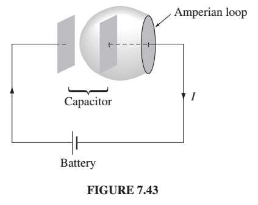

#### To review from last time: 

We talked about Ohm's law not really being a law, but rather something that a lot of
materials seem to follow.  In it's general form it looks like this:

$$
\vec{J} = \sigma \vec{E}
$$

We talked about an average speed of charges as they undergo collisions in a constant
electric field, and we came up with:

$$
\vec{J} = nfq\vec{v}_{ave} = \left(\frac{nf\lambda q^2}{2m_e v_{thermal}}\right) \vec{E}
$$

which shows
why conductivity ($$\sigma$$) is proportional
to charge density and why it increases with decreasing temperature.

Armed with this notion of Ohm's law, we could talk about what creates a constant
current in circuit.  An emf $$\epsilon$$ is the integral of force per charge
around a current. We used the notion of magnetic flux, and emf to find the flux rule:

via the flux rule:
$$
\epsilon = -\frac{d\Phi}{dt}
$$

and then Faraday's law.

$$
\nabla \times \vec{E} = - \frac{\partial \vec{B}}{\partial t}
$$

#### Now today!!!
We can put them all together:

Gauss' Law

$$
\nabla \cdot \vec{E} = \frac{1}{\epsilon_0} \rho
$$

(no name...no magnetic monopoles?)

$$
\nabla \cdot \vec{B} = 0
$$

Faraday's Law

$$
\nabla \times \vec{E} = -\frac{\partial\vec{B}}{\partial t}
$$

Ampere's Law 

$$
\nabla \times \vec{B} = \mu_0 \vec{J} 
$$

where we're going today is that we need another term on this.  We need it to look like
this...  It's pretty important.

Ampere's Law with Maxwell's correction

$$
\nabla \times \vec{B} = \mu_0 \vec{J} + \mu_0 \epsilon_0 \frac{\partial\vec{E}}{\partial t}
$$

Why is that important?  Well the equations kinda look bad without it.  A changing
B-field produces and E-field but a changing E-field doesn't produce a B-field? That
confounds our sense of symmetry (and reference frames.)

More mathematically...

We use the old rule that the divergence of the curl is always zero.  We take the divergence
of both sides of Faraday's Law:

Faraday's Law

$$
\nabla \cdot (\nabla \times \vec{E}) = \nabla \cdot \left(-\frac{\partial\vec{B}}{\partial t}\right) = \frac{\partial}{\partial t} (\nabla \cdot \vec{B})
$$

The left side has to be zero because the divergence of a curl is zero.  The right side is zero by the
no-magnetic-monopoles law.  So Faraday's law looks fine.

Ampere's law has problems.  Let's do the same thing:

$$
\nabla \cdot (\nabla \times \vec{B}) = \mu_0 (\nabla \cdot \vec{J}) 
$$

The left side must be zero but the right side is not.  For steady currents the divergence of
$$\vec{J}$$ is zero, but if we go beyond a static situation it's not.  (For example, imagine
you're standing somewhere and spewing out electrons in all directions.  The divergence of $$\vec{J}$$
is not zero.

(I skipped this example in 2020, but Griffiths does it in the book if you're interested.)
Also, consider a capacitor that you're charging up.  The integral version of Ampere's law is

$$
\oint \vec{B}\cdot d\vec{l} = \mu_0 I_{enc}
$$

Look at the diagram below. Charge/current is coming out the battery and flowing to the capacitor.
Positive charge is flowing to the left plate, and negative charge is flowing to the right plate.
We know the current is changing as a function of time, i.e. once the capacitor is charged
the current will stop flowing.

So let's use the integral version of Ampere's law. (I actually think what I'm about to say 
was a problem you were having with Ampere's law some weeks ago - there's a problem with
what you mean by the current "enclosed" in the loop.) More precisely, what you mean is
the current piercing the surface that has the loop for its boundary. We kind of ignored that
before. We just kind of assumed we met the surface that is in the same plane at the loop, but
Ampere's law doesn't apply just to planar loops - it applies to all surfaces!  So let's draw
the surface as below (Figure 7.43 from the book.) It doesn't include any current!

{:class="img-responsive"}]

So we need a way to kill off the divergence in Ampere's law.  The right
side is currently (before fixing):

$$
\nabla \cdot \vec{J} = -\frac{\partial \rho} {\partial t} 
$$

That's just the continuity equation from chapter 5, which I don't think
we talked about enough.  The basic idea is that if you're standing there throwing
out charges, then the charge density is decreasing where you are. That's the
continuity equation.

We can replace $$\rho$$ using Maxwell's equation for the divergence
of E.  So now the right side is...

$$
-\frac{\partial}{\partial t} (\epsilon_0 \nabla \cdot \vec{E}) = \nabla \cdot\left(\epsilon_0\frac{\partial\vec{E}}{\partial t}\right)
$$

So, we can make the right side of Ampere's law divergence-less if we add this
back in.

So when the dust clears we have our new version's of Maxwell's equations:

Gauss' Law

$$
\nabla \cdot \vec{E} = \frac{1}{\epsilon_0} \rho
$$

(no name...no magnetic monopoles?)

$$
\nabla \cdot \vec{B} = 0
$$

Faraday's Law

$$
\nabla \times \vec{E} = -\frac{\partial\vec{B}}{\partial t}
$$

Ampere's Law 

$$
\nabla \times \vec{B} = \mu_0 \vec{J} + \mu_0\epsilon_0\frac{\partial\vec{E}}{\partial t}
$$

But these aren't the most useful way to write them as we have seen in the last
several weeks using both the Displacement vector and the Auxiliary Current.

We'll need to add one thing for this non-static case.  Let's look at what
we have so far with magnetization and polarization.  The electric polarization
$$\vec{P}$$ produces a bound charge density

$$
\rho_b = -\nabla \cdot \vec{P}
$$

and likewise we get bound current from a derivative of magnetization.

$$
\vec{J_b} = \nabla \times \vec{M}
$$

Here's why you get a bound current from a changing magnetization:
Imagine that you've got a change E-field, and a linear dielectric,
and so the polarization is proportional to the E-field and the polarization
is changing. Remember polarization comes from all the dipolar atoms kind of
rearranging themselves.......yes, so you'll get a current as they rearrange
themselves. 

$$
\vec{J}_p = \frac{\partial\vec{p}}{\partial t} 
$$

This is called the polarization current.

So we've got two separate currents arising from fields in matter, the
bound current $$\vec{J}_b$$ arises from the spin and orbital motions of
electrons, and $$\vec{J}_p$$ the polarization current, is from the linear
motions of charge.

When we put everything together (as you can see Griffiths do on page 341) we
know that a change electric field produces a magnetic field, and the
electric field is the sum of the field from the bound charge and the free charge.
So then it follows that if there's a dE/dt term in the $$\nabla \times B$$ 
Maxwell's equation, then when we express it in terms of H and D, the
derivative of the polarization is also part of the $$\nabla \times B$$ equation.

So Maxwell's equations in matter end up looking like this:
Gauss' Law

$$
\nabla \cdot \vec{D} = \rho_f
$$

(no name...no magnetic monopoles?)

$$
\nabla \cdot \vec{B} = 0
$$

Faraday's Law

$$
\nabla \times \vec{E} = -\frac{\partial\vec{B}}{\partial t}
$$

Ampere's Law 

$$
\nabla \times \vec{H} = \vec{J}_f + \frac{\partial \vec{D}}{\partial t}
$$

And embedded in that derivative of D is the derivative of P that we just 
surmized.  If you want to see the whole thing mathematically, see page
341.

Jesse asked a good question about Ampere's law.  It looks like there's a sign
error in it, he suggested.   There's not.  Here's why it seems like there should be.  
We have 3 contributions to the current density,
the free current density, the bound current density, and the polarization
current density.  H is supposed to be due ONLY to the free current density,
so we have to subtract off the contributions from the bound current density
and the polarization current density. 

I'm not sure this satisfied Jesse's question, but here's how it works out mathematically:

$$
\vec{J} = \vec{J}_f + \vec{J}_b + \vec{J}_p
$$

$$
\vec{J} = \vec{J}_f + \nabla \times \vec{M} + \frac{\partial\vec{P}}{\partial t}
$$

Ampere's law is:

$$
\nabla \times \vec{B} = \mu_0\vec{J} +  \mu_0\epsilon_0 \frac{\partial\vec{E}}{\partial t}
$$

Put our expression for $$J$$ into Ampere's law:

$$
\nabla \times \vec{B} = \mu_0\left({J}_f + \nabla \times \vec{M} + \frac{\partial\vec{P}}{\partial t}\right)
 +  \mu_0\epsilon_0 \frac{\partial\vec{E}}{\partial t}
$$

Bring the $$M$$ over the other side and divide by $$\mu_0$$

$$
\frac{1}{\mu_0}\nabla \times \vec{B} - \nabla \times \vec{M} = {J}_f + \frac{\partial\vec{P}}{\partial t} +  \epsilon_0 \frac{\partial\vec{E}}{\partial t}
$$

Use our definition of H:

$$
\vec{H} = \frac{1}{\mu_0} \vec{B} - \vec{M}
$$

to rewrite the left side:

$$
\nabla \times \vec{H} = {J}_f + \frac{\partial\vec{P}}{\partial t} +  \epsilon_0 \frac{\partial\vec{E}}{\partial t}
$$

Use our definition of $$D$$:

$$
\vec{D} = \epsilon_0 \vec{E} + \vec{P}
$$

to rewrite the right side

$$
\nabla \times \vec{H} = {J}_f +  \frac{\partial\vec{D}}{\partial t}
$$

And we've got the correct expression relating H, D, and J.   But I think Jesse was looking to get a feeling
for why the time derivative of D would be added to H.....Jesse, any thoughts?

(In 2020 we didn't actually do this problem...we actually had time, but we weren't emotionally prepared. I was also
confused about what he means by conduction current - I think that's the same as free current.  )
Problem 7.40 Sea water at frequency $$\nu = 4\times 10^8$$ Hz has permittivity $$\epsilon = 81\epsilon_0$$,  permeability $$\mu = \mu_0$$, and resistivity $$\rho = 0.23 \Omega$$ m. What is the ratio of conduction current to displacement current? [Hint: Consider a parallel-plate capacitor immersed in sea water and driven by a voltage $$V_0 cos(2π\nu t)$$.] 
