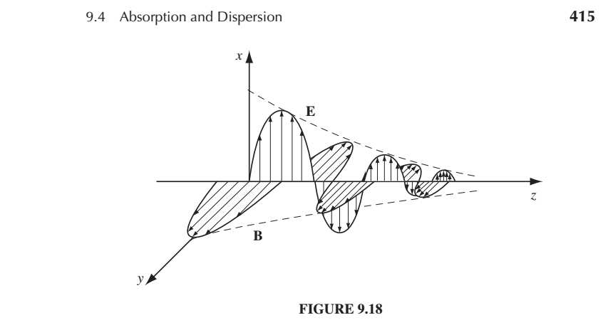

#### Announcements:
* Please put your ID number of your homework.
* Please make your homework legible.  It requires a bit more effort now since 
scanning loses some information.  Thank you!!
* Solutions to exam are on Moodle.  I can't figure out a realistic way to return your
exams to you, but I'm happy to talk to you about it.  Sign up for one of my times and I can send you pictures of whatever you want.

#### To review from last time: 

* If you take the curl of both side of each of Maxwell's curl equations, you
can decouple E and B from each other.  You get waves that travel at a velocity
$$v = \frac{1}{\sqrt{\epsilon_0 \mu_0}} = c$$.
* The wave equation is close to the Simple Harmonic Oscillator equation that we
spent most of PHY213 dealing with, but now it propogates in time.
* $$
\vec{E(x,t)} = E_0cos[k(x - vt) + \delta]\hat{y}
$$ is a wave traveling to the right (toward positive x) with velocity $$v$$. 
* In order to satisfy the relationship between E and B in Maxwell's equations (and therefore for the wave to propagate) we need:
$$\widetilde{B_0}  = \frac{1}{c} (\hat{k} \times \widetilde{E_0})$$

In total, we dealt with waves in a vacuum, polarized in the y direction, and traveling in the x-direction.  We
need to generalize that in a bunch of ways:

* Can they please be polarized in any direction, not just y? (Yes, but polarization direction must be perp to
propagation direction)
* Can they please travel in any direction, not just x? (yes, we just take x-> $$\vec{r}$$ and kx gets replaced
with $$\vec{k}\cdot\vec{r}$$
* Can they travel in linear media (i.e. with $$\epsilon$$ and $$\mu$$?)?  (Yes, honestly those are so similar
that that part is *almost* boring)
* Can they travel in conducting media? (Yes, but they don't travel far....you start to get complex $$k$$...what
happens if I make k complex???.)

####  Polarization

**First lets get these things traveling in any direction we want**

Last time we seemed to be constrained to having waves travel in x direction with polarization in
y direction.  Like this:

$$
\vec{E(x,t)} = E_0cos[kx - \omega t) ]\hat{y}
$$

which is also the same thing as

$$
\widetilde{E(x,t)} = \widetilde{E_0}e^{i[kx - \omega t) ]}\hat{y}
$$

where $$\vec{E} = Re[\widetilde{E}]$$.

Just so we don't get in a rut and think they have to travel always in x direction let's say:

$$
\widetilde{E(z,t)} = \widetilde{E_0}e^{i[kz - \omega t) ]}\hat{y}
$$

But we don't have to have it polarization in the $$y$$ direction.

$$
\widetilde{E(z,t)} = \widetilde{E_0}e^{i[kz - \omega t) ]}\hat{x}
$$

(It can't be polarized in the z direction because polarization must be perp to propagation.  That's
what we mean by "transverse."  The thing that's oscillating is oscillating perpendicular to the direction
of propagation.  That's why Griffiths likes waves on string.  They're tranverse too.)

But let's get really crazy and say that they could be polarized somewhere in between x and y.  

$$
\widetilde{E(z,t)} = \widetilde{E_0}e^{i[kz - \omega t) ]}\hat{n}
$$

where

$$
\hat{n} = \cos\theta\hat{x} = \sin\theta\hat{y}
$$

and we require that

$$
\hat{n}\cdot\hat{z} = 0
$$

(Brief diversion into longitudinal version.  A longitudinal wave would be:

$$
\widetilde{E(x,t)} = \widetilde{E_0}e^{i[kx - \omega t) ]}\hat{x}
$$

which is absolutely a solution of the wave equation that we derived last time:

$$
\nabla^2\vec{E} =  \mu_0\epsilon_0 \frac{\partial^2\vec{E}}{\partial t^2}
$$

but it's not consistent with all of Maxwell's equations.  Last time we took our equation for E and
asked, what our equation for B would need to look like.  We said:

$$
\widetilde{B(x,t)} = \widetilde{B_0}e^{i(kx - \omega t) }\hat{?}
$$

We used Faraday's Law:

$$
\nabla \times \vec{E} = -\frac{\partial\vec{B}}{\partial t}
$$

Maybe if I lose connectivity for a minute you could convince yourself that if you have an E that
follows the equation above, there's no B that's not 0 that is consistent with Faraday's law, so therefore
the only amplitude of the longitudinal E wave that can exist is zero.

End brief diversion.)

#### Generalizing the direction
There's nothing special about the direction x that we did on Monday or the direction z that we have today.
In general, the wave can be traveling in an arbitrary direction $$\vec{k}$$.
And then the solution looks like this:

$$
\widetilde{E(\vec{r},t)} = \widetilde{E_0}e^{i(\vec{k}\cdot\vec{r} - \omega t) ]}\hat{n}
$$

$$
\widetilde{B(\vec{r},t)} = \frac{1}{c} \widetilde{E_0}e^{i(\vec{k}\cdot\vec{r} - \omega t) ]}(\hat{k} \times\hat{n}) = \frac{1}{c} \hat{k} \times \vec{E}
$$

where $$\vec{n}$$ is the polarization, the direction of the E-field.

The next time I lose connectivity convince yourself that if

$$
\vec{n} = \hat{y}
$$

like on Monday.  And $$\vec{k} = k\hat{x}$$ like on Monday then you get back..

$$
\widetilde{E(\vec{r},t)} = \widetilde{E_0}e^{i(kx - \omega t) ]}\hat{y}
$$

where $$\vec{r} = x\hat{x} y\hat{y} + z\hat{z}$$.

####  A quandary for you involving the superposition of two linearly polarized waves:

Remember that we can superpose any solutions of the wave equation and still get a solution
to the wave equation.  So it follows that this is a solution to the wave equation:

$$
\widetilde{E((x,t)} = \widetilde{E_0}e^{i(kx - \omega t) ]}\hat{y} + \widetilde{E_0}e^{i(kx - \omega t) + \pi/2 ]}\hat{z}
$$

where I have two waves, each with a different polarization.  One of them is out of phase from the 
other by 90 degrees, or pi over 2.  What does this look like?

[Animation of various polarizations of a wave](https://www.youtube.com/watch?v=Fu-aYnRkUgg)

### Linear Media

Let's look at Maxwell's equations in Media:

Gauss' Law

$$
\nabla \cdot \vec{D} = \rho_f
$$

(no name...no magnetic monopoles?)

$$
\nabla \cdot \vec{B} = 0
$$

Faraday's Law

$$
\nabla \times \vec{E} = -\frac{\partial\vec{B}}{\partial t}
$$

Ampere's Law

$$
\nabla \times \vec{H} = \vec{J}_f + \frac{\partial \vec{D}}{\partial t}
$$

If the medium is linear, i.e.

$$
\vec{D} = \epsilon \vec{E}
$$

and

$$
\vec{H} = \frac{1}{\mu} \vec{B}
$$

and homogeneous, i.e. $$\epsilon$$ and $$\mu$$ don't vary from point to point, and we
have no free charge or free current (we're getting to that) then we can
write these equations like this

$$
\nabla \cdot \vec{E} = 0
$$

$$
\nabla \cdot \vec{B} = 0
$$

$$
\nabla \times \vec{E} = -\frac{\partial\vec{B}}{\partial t}
$$

$$
\nabla \times \vec{B} = \mu\epsilon\frac{\partial \vec{E}}{\partial t}
$$

which are exactly our equations in free space (see Monday's lecture) except now
we've replace $$\mu_0$$ by $$\mu$$ and $$\epsilon_0$$ by $$\epsilon$$.  So everything
we've done so far holds for waves in linear media, but now the velocity is
different, i.e.

$$
v = \frac{1}{\sqrt{\mu\epsilon}}
$$

So that's kind of either boring or kinda awesomely elegant.  I think it's awesomely elegant.
And now you know why we need to deal with E and B fields in media, so that we could say that.

#### Waves in Conductors
Jesse asked about this on Monday.  We keep saying there's no charge and no current.....and that's how we derived the equations.  What happens if we have charge and current? 

What would you guess happens to a wave in a conductor?
(Ans: it shouldn't last long, because we said conductors rearrange themselves to get rid of fields inside them.  It
can't happen instantaneously, which is why this is interesting. Again, that's why this is called
electrodynamics.)

So in a conductor we can use Ohm's "law":

$$
\vec{J}_f = \sigma \vec{E}
$$

and we can use the continuity equation $$\nabla \cdot \vec{J}_f = -\frac{\partial \rho_f}{\partial t}$$ (which remember is just a statement that if I'm tossing out protons in all directions then charge density at my location
better be decreasing. The continuity equation would be true for money too - if I'm sending dollar bills
away in all directions, then the cash density at my location is decreasing.)

Let's first combine those to get a relationship for $$\rho_f$$ as a function of time.

First rearrange the continuity equation very slightly:

$$
\frac{\partial \rho_f}{\partial t} = - \nabla \cdot \vec{J}_f 
$$

and now replace $$\vec{J}_f$$ with $$\sigma\vec{E}$$ using Ohm's "law".

$$
\frac{\partial \rho_f}{\partial t} = - \nabla \cdot \sigma\vec{E} 
$$

Rearrange.

$$
\frac{\partial \rho_f}{\partial t} = - \sigma \nabla \cdot \vec{E} 
$$

And use Gauss's law to replace the divergence of E.

$$
\frac{\partial \rho_f}{\partial t} = - \sigma  \frac{\rho_f}{\epsilon}
$$

Rearrange slightly.

$$
\frac{\partial \rho_f}{\partial t} = -\frac{\sigma}{\epsilon} \rho_f
$$

Well that looks pretty tame.  Write down on your paper your guess for what the
solution of that looks like.

Ans

$$
\rho_f(t) = e^{-i\left(\frac{\sigma}{\epsilon}\right)t} \rho_f(0)
$$

So the free charge density is decreasing exponentially in time.  The higher the
conductivity $$\sigma$$ the faster it's decreasing in time.  

So even if we have some free-charge to start in a conductor it will dissipate very quickly.
(You're familiar with this idea - we just never put an equation to it - we just said it
goes away really fast so we're not going to deal with it.  That's still true!!)

Maxwell's equations in linear media look like

$$
\nabla \cdot \vec{E} = \frac{1}{\epsilon} \rho_f 
$$

$$
\nabla \cdot \vec{B} = 0
$$

$$
\nabla \times \vec{E} = -\frac{\partial\vec{B}}{\partial t}
$$

$$
\nabla \times \vec{B} = \mu\sigma\vec{E} + \mu\epsilon\frac{\partial \vec{E}}{\partial t}
$$

Those are more general than the ones above because they include the the free charge and current
terms. (I should really do what my graduate E&M professor did and write down M's equation every time. In
your brain maybe realize that you could do that.)

So we just argued that the $$\rho_f$$ goes away really quickly.  

But we still have that second to the last term which is the only thing different than what we started
with when we derived the wave equation originally.

We can do the same process (which we won't) and apply the curl to both curl equations.  We end up
with an E equation that looks like this (and a B equation that looks exactly like it.)

$$
\nabla^2 \vec{E} = \mu\sigma\frac{\partial\vec{E}}{\partial t} + \mu\epsilon\frac{\partial^2\vec{E}}{\partial t^2}
$$

That (and its B counterpart) still have plane-wave solutions

$$
\widetilde{E(x,t)} = \vec{\widetilde{E_0}}e^{i[\tilde{k}z - \omega t) ]}
$$

but now you need a complex wavenumber $$\tilde{k}$$ to make it work.  (Do you see why?  Without that first
time, we have two derivatives in space proportional to two derivatives in time.  One brings down two
omega's and one brings down two k's.  All the i's end up squared, so there aren't any imaginary numbers.
Now however, we've got a single time derivative and a double time
derivative, and so you'll get the square of k having to be imaginary.)

$$
\tilde{k}^2 = \mu\epsilon\omega^2 + i\mu\epsilon\omega
$$

(If my internet goes out, plug this into the equation above and prove to yourself that it works.)

We usually write $$\tilde{k}$$ like this:

$$
\tilde{k} = k +i\kappa
$$

where

$$
k = \omega\sqrt{\frac{\epsilon\mu}{2}}\left[\sqrt{1 + \left(\frac{\sigma}{\epsilon\omega}\right)^2} + 1 \right]^{1/2}
$$

$$
\kappa = \omega\sqrt{\frac{\epsilon\mu}{2}}\left[\sqrt{1 + \left(\frac{\sigma}{\epsilon\omega}\right)^2} - 1 \right]^{1/2}
$$

And then we usually write the solutions like this:

$$
\widetilde{E(x,t)} = \vec{\widetilde{E_0}}e^{-\kappa z}e^{i[kz - \omega t) ]}
$$

So just like in 213!!! You've got an exponential envelope multiplying a sine wave.  This is what
we have for a damped oscillator.  The free current provides damping.

The solution looks like this:

{:class="img-responsive"}]

The "skin-depth" or the amount of distance over which the wave decreases by a factor of $$e$$ is

$$
d = \frac{1}{\kappa}
$$

So does this solution do all the things we think. Check:
* If we set $$\sigma =0$$ then our solution shouldn't diminish in amplitude at all, and k should be real.  Check.

What do you notice in the solution!!
Yes, B is lagging behind E.  That's a consequence of doing that same exercise we did last class of
finding the relationship between E and B.  
Using Faraday's law and starting with....

$$
\widetilde{E(x,t)} = \widetilde{E_0}e^{-\kappa z}e^{i[kz - \omega t]}\hat{x}
$$

you end up with...

$$
\widetilde{B(x,t)} = \frac{\tilde{k}}{\omega}\widetilde{E_0}e^{-\kappa z}e^{i[kz - \omega t) ]}\hat{y}
$$

but that $$\tilde{k}$$ is actually a complex number so just like we did in PHY213 we set

$$
\tilde{k} = Ke^{i\phi}
$$

and we get

$$
\phi = \tan^{-1}(\kappa/k)
$$

(I'm not gonna write out K because I'm too lazy...but it does mean that the ratio of the (real) amplitudes
of E and B are different than they were before.)

#### Review, backwards

* In a conductor you end up with an attenuated solution:
$$
\widetilde{E(x,t)} = \vec{\widetilde{E_0}}e^{-\kappa z}e^{i[kz - \omega t) ]}
$$
and the current acts like a damping agent.  B lags E in phase.
* In a linear medium, you end up with exactly the same wave equations you had before, but with a different
velocity $$
v = \frac{1}{\sqrt{\mu\epsilon}}
$$
* The polarization vector points where E points.  If it's linearly polarized it stays in a plane.  The combination
of two linearly polarized waves with a phase shift between them gets you a circularly polarized wave.
* A more general way of writing the solutions to the wave equations for arbitrary propagation and polarization is

$$
\widetilde{E(\vec{r},t)} = \widetilde{E_0}e^{i(\vec{k}\cdot\vec{r} - \omega t) ]}\hat{n}
$$

$$
\widetilde{B(\vec{r},t)} = \frac{1}{c} \widetilde{E_0}e^{i(\vec{k}\cdot\vec{r} - \omega t) ]}(\hat{k} \cdot\hat{n}) = \frac{1}{c} \hat{k} \times \vec{E}
$$

where $$\vec{n}$$ is the polarization, the direction of the E-field and $$\vec{k}$$ is the direction of propagation.
