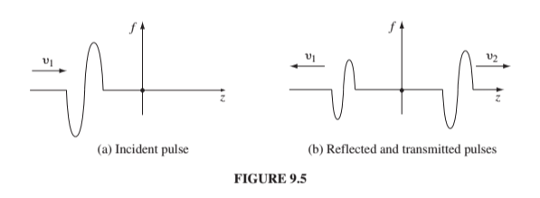
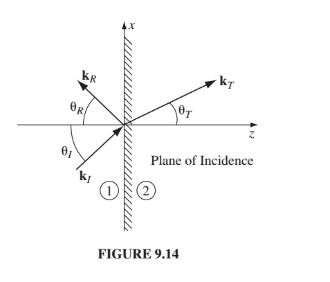
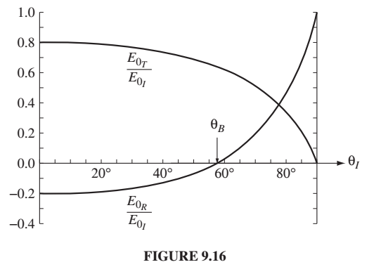

(This ended up being a 2-class lecture in 2020.)

#### Announcements:
* Please put your ID number of your homework.

#### Goals:
* I want to try to start everything from here on out
with Maxwell's equations, so that you
get that there aren't really a bunch of equations.  Just 4.

* You understand the ways in which transmission across a boundary in a string,
or in and EM wave are the same, and how they're different.
-------this is about how far we'll get the first day-----
* You understand the ways in which transmission across a boundary involving
a dielectric and a conductor are the same, and how they're different.
* You understand Brewster's angle

#### Question for you:  I'd like you to type your answer into a private chat with me on the Zoom.  First, let me just say that when a wave enters a different
medium (from vacuum to a dielectric or to a conductor) that part of it is 
reflected and
part of it is transmitted. Question, what do you think is different  in
what happens in a vacuum/conductor interface and a vacuum/dielectric interface?    
#### To review from last time: 

#### Review

* A more general way of writing the solutions to the wave equations for arbitrary propagation and polarization is

$$
\widetilde{E(\vec{r},t)} = \widetilde{E_0}e^{i(\vec{k}\cdot\vec{r} - \omega t) ]}\hat{n}
$$

$$
\widetilde{B(\vec{r},t)} = \frac{1}{c} \widetilde{E_0}e^{i(\vec{k}\cdot\vec{r} - \omega t) ]}(\hat{k} \cdot\hat{n}) = \frac{1}{c} \hat{k} \times \vec{E}
$$

where $$\vec{n}$$ is the polarization, the direction of the E-field and $$\vec{k}$$ is the direction of propagation.
* The polarization vector points where E points.  If it's linearly polarized it stays in a plane.  The combination
of two linearly polarized waves with a phase shift between them gets you a circularly polarized wave.

* In a linear medium, you end up with exactly the same wave equations you had before, but with a different
velocity $$
v = \frac{1}{\sqrt{\mu\epsilon}}
$$
* In a conductor you end up with an attenuated solution:
$$
\widetilde{E(x,t)} = \vec{\widetilde{E_0}}e^{-\kappa z}e^{i[kz - \omega t) ]}
$$
and the current acts like a damping agent.  B lags E in phase.

#### TODAY our goal is to understand:
* In dielectric or conductor, the relationship between reflected and 
incident waves is:

$$
\tilde{E}_{0,R} = \frac{1-\beta}{1+\beta}\tilde{E}_{0,I}
$$

where $$\tilde{E}_{0,R}$$ is the reflected amplitude
and $$\tilde{E}_{0,I}$$ is the incident amplitude.
The $$0$$ refers to the fact that this is a scalar amplitude.

and 
$$
\beta \equiv \frac{\mu_1 v_1}{\mu_2 v_2}
$$

There's a similar relationship between transmitted and reflected
although the 1-beta turns into a 2.

In a conducting media it's the same formula for the relationship but
$$\beta$$ can be complex and is somewhat different.

$$
\tilde\beta \equiv \frac{\mu_1 v_1}{\mu_2 \omega}\tilde{k}_2
$$

You can already see that if you're in a dielectric medium, $$v_2$$ is
$$\omega/k_2$$ and you get the same thing back again.

Those are the equations we're after, but we want to see how meeting the
boundary conditions gets us those.  And we want to see what they mean.
In short what they mean is that:

* If $$v_2 > v_1$$ then the reflected wave remains upright.
* If $$v_1 > v_2$$ then the reflected wave is inverted.

#### A note about the order of my lectures as compared to the order in the book
Griffiths does waves on a string (9.1), EM waves in vacuum (9.2), EM waves in linear media (9.3), and EM waves
in conductors (9.4) and for each one he (a)comes up with the wave equation,
(b) finds its solutions, (c) discusses polarization states, and (d) matches boundary conditions and finds reflected
and transmitted properties. 

I, instead, 
* didn't really talk about waves on strings (although I will today)
* on Monday found the wave equation for all EM waves (vacuum, linear, conductor)
* on Wednesday discussed polarization for all EM waves
* today I'm talking about reflection and transmission in all of them.

#### Reflection and transmission on strings.
In 9.1.3 Griffiths starts with string and shows that if you attach two
strings together (by tying them together), and send a wave down one end
toward the place where they are tied together, you'll get reflection and
transmission at the boundary, i.e. the place where they're tied together.

Cutely, or confusingly, depending on your perspective, he calls the
mass per unit length $$\mu$$.  The velocity of a wave on a string
is

$$
\sqrt\frac{T}{\mu}
$$
/bin/bash: k: command not found

Here's what the situation looks like:
{:class="img-responsive"}

Here's how we write what the waves look like:
For the region to the left of the interface ($$z<0$$)

$$
\tilde{f}(z,t) = \tilde{A}_Ie^{i(k_1z - \omega t) + \tilde{A}_Re^{i(-k_1z - \omega t)}a}
$$

The actual wave is the real part of this.  It turns out you need the amplitudes
to be complex now, because you have to deal with the phase difference
at the interface as the wave gets reflected and transmitted.

For the region to the right of the interface ($$z>0$$)

$$
\tilde{f}(z,t) = \tilde{A}_Te^{i(k_1z - \omega t)} 
$$

The boundary conditions are sort of intuitive on a string, which is why
it's nice to start with them.  Your string has to be continuous, i.e.

$$
\tilde{f}(0^-,t) = \tilde{f}(0^+,t)
$$

and slightly less intuitive...

$$
\frac{\partial \tilde{f}}{\partial z}|_0-=\frac{\partial \tilde{f}}{\partial z}|_0+
$$

but that really just means your string can't have a kink in it.  If it
does have a kink in it you can infinite force and then infinite acceleration.
(Recall from 213 that the force on the string is the derivative of its
slope).

So the procedure then, that we we also apply to EM waves in a moment, but which
I think is more intuitive in strings, is that you apply the boundary conditions
to those waves on either side of the interface, just like we did in static
situations, and they give you the relationship between the A's.

Here's what you get:

$$
\tilde{A}_R = \left(\frac{v_2-v_1}{v_2+v_1}\right)\tilde{A}_I
$$

$$
\tilde{A}_T = \left(\frac{2v_2}{v_2+v_1}\right)\tilde{A}_I
$$

* If $$v_2 > v_1$$ then the reflected wave remains upright.
* If $$v_1 > v_2$$ then the reflected wave is inverted.

(Griffiths does this by breaking the reflected and transmitted wave amplitudes
into their real and imaginary parts, but in my opinion it kind of obscures
something that's pretty simple. In fact, I'm not even sure we needed
to make those A's complex.  Maybe he did that so that we'd be more used
to it when we're doing EM waves.)

These results check out in the following ways:
* If $$v_1 = v_2$$ then you get no reflected wave.
* If $$\mu_2 = \infty$$ then $$v_2=0$$ and you get no transmitted wave
and $$A_R = -A_L$$.

So now that we've kind of got the hang of this in strings.  Let's do
this with EM waves.

#### Reflection and Transmission in EM waves

We've really got the same thing but now $$k = \sqrt{\frac{1}{\epsilon\mu}}$$.

What are the boundary conditions?  They're the same ones we had at
a boundary when we were dealing with media.  So we could go back and look
them up, but we said we'd get everything from Maxwell's equations, so
let's do it... (plus it's good review.)

**Maxwell's equations in Media:**

Gauss' Law

$$
\nabla \cdot \vec{D} = \rho_f
$$

(no name...no magnetic monopoles?)

$$
\nabla \cdot \vec{B} = 0
$$

Faraday's Law

$$
\nabla \times \vec{E} = -\frac{\partial\vec{B}}{\partial t}
$$

Ampere's Law

$$
\nabla \times \vec{H} = \vec{J}_f + \frac{\partial \vec{D}}{\partial t}
$$

If the medium is linear, then 

$$
\vec{D} = \epsilon \vec{E}
$$

and

$$
\vec{H} = \frac{1}{\mu} \vec{B}
$$

#### So how do these get us the boundary conditions?
This is going way back to section 2.3.5 (pg 88). 
Look at Gauss' law.  We can draw a wafer-thin pill
box over the boundary (the flat side of the wafer is
parallel to the boundary) and use the divergence theorem (and
the fact that we don't have free charge....yet) to get:

$$
\oint_S \vec{D} \cdot d\vec{a} = 0
$$

where $$\sigma_f$$ is the charge per area in that thin area.
Our pill box is wafer thin so the only part that contributes
to the integral is on the circular area part. And it only
brings up the component that's perpendicular to the surface so

$$
D_1^\perp = D_2^\perp
$$

which means
$$
\epsilon_1 E_1^\perp = \epsilon_2 E_2^\perp
$$

There's one boundary condition.  Only 3 to go! (We might not have time
to do all of these...)

For E-parallel we use the fact that we can express E as a potential of
a scalar (which comes from the fact that E is curl-free, which isn't
true anymore in electrodynamics!!!  Oh no!!!  But we're still using
that boundary condition.....we can't tackle this until we deal with
chapter 10 - which is all about how the potential formulation changes
in the dynamics case....

In any case, we got this:

$$
E_1^\| = E_2^\| 
$$

From the fact that $$\oint\vec{E}\cdot d\vec{l} = 0$$ because you're
starting and stopping the integral in the same place and the potential
can't be path dependent.   So if you draw a really small loop (with long
side in the direction of E) you get that the E-above and E-below have
to be the same along that loop.  So E-parallel is continuous.  It's
still true in the dynamics case.

For the sake of time, I'll say that the restriction on B-perp comes
from unnamed no-magnetic monopoles Maxwell's equation:
(Page 250 Griffiths 5.4.2)

$$
\oint \vec{B}\cdot d\vec{A} =0
$$

and the tangential component comes from Ampere's law: 
$$
\oint \vec{B}\cdot d\vec{l} =\mu_0I_{enc}
$$

So the boundary conditions we have in the order of how we usually
write Maxwell's equations are:

$$
\epsilon_1E_1^\perp = \epsilon_2E_2^\perp   
$$

$$
B_1^\perp = B_2^\perp
$$

$$
\vec{E}_1^\| = \vec{E}_2^\| 
$$

$$
\frac{1}{\mu_1}\vec{B}_1^\| =  \frac{1}{\mu_2}\vec{B}_2^\|   
$$

Perhaps you won't actually go through the derivation for each
every time, but notice that $$\epsilon$$ is involved in the first
one because Gauss' law got replace with $$\vec{D}$$. The next
two laws are unchanged in media, so they don't have $$\epsilon$$'s and
$$\mu$$'s in them.  The last one has the $$\mu$$ back in it because
that's Faraday's law that we write in terms of $$\vec{H}$$ in media.

(Remember there are only vectors over the last two because there
are two parallel components so those are really each two equations.) 

#### Finally we're ready to apply the boundary conditions to the waves..
We need to write down the waves first..

Here's the incident wave...

$$
\vec{\tilde{E}}_I(z,t) = \tilde{E}_{0,I}e^{i(k_1z-\omega t)}\hat{x}
$$

we're assuming that is incident (perpendicularly) on a boundary with a different epsilon
and mu.  

You can write down all the other waves from what you know about the
relationship between the polarization and the direction...

Take a minute and write down what B should look like knowing what you know
about the relationship between E and B (from Monday's and Wednesday's lectures)

$$
\vec{\tilde{B}}_I(z,t) = \frac{1}{v_1}\tilde{E}_{0,I}e^{i(k_1z-\omega t)}\hat{y}
$$

(Notice we need to specify the speed in medium 1 because we're about
to change media.  The fact that it's in direction y is because we
know B has to be in the direction of k cross n. z cross x is y)

We don't know the amplitude of the reflected wave, but we know it's
going in the other direction so we can write that one down like this

$$
\vec{\tilde{E}}_R(z,t) = \tilde{E}_{0,R}e^{i(-k_1z-\omega t)}\hat{x}
$$

And now you write down its B field.

$$
\vec{\tilde{B}}_R(z,t) = -\frac{1}{v_1}\tilde{E}_{0,R}e^{i(-k_1z-\omega t)}\hat{y}
$$

(Still in medium 1.  Had to put a minus sign to preserve the relationship
between E, B and the propagation direction. How did I get to assume
E is in the same direction, but I got to reverse B? 
Remember that $$E_R$$ is unknown, so if it turns out to be negative and
the E-field is reversed, then we'll get a negative number for $$E_R$$.  All
we're doing now is preserving the relationship between E, B, the the
propagation direction.

The transmitted wave looks like this:

$$
\vec{\tilde{E}}_T(z,t) = \tilde{E}_{0,T}e^{i(k_2z-\omega t)}\hat{x}
$$

$$
\vec{\tilde{B}}_T(z,t) = \frac{1}{v_2}\tilde{E}_{0,T}e^{i(k_2z-\omega t)}\hat{y}
$$

I need a different k and a different velocity, but I know the direction,
and I know the relationship between E and B.

Here's what it looks like

{:class="img-responsive"}]

Now you've got all the ingredients, and you need to apply the boundary conditions. 

The first two are about the perpendicular component of the wave, but our
wave is transverse so there is no component of the wave perpendicular to
the interface (that will be more interesting in the non-normal version).

The third BC is just that the parallel E-fields have to be the same
on both sides.  That amounts to:

$$
\tilde{E}_{0,I}+ \tilde{E}_{0,R}= \tilde{E}_{0,T}
$$

This won't be true when we have a wave that's not perpendicular to the interface.  At that point it will involve cosines.  And will get you Snell's law (I've
left that as an exercise for you.)

The fourth BC (from Faraday's law) gets us:

$$
\frac{1}{\mu_1}\left(\frac{1}{v_1}\tilde{E}_{0,I} - \frac{1}{v_1}\tilde{E}_{0,R}\right) = \frac{1}{\mu_2}\left(\frac{1}{v_2}\tilde{E}_{0,T}\right)
$$

when you put those all together you get one of our punchlines:

$$
\tilde{E}_{0,R} = \frac{1-\beta}{1+\beta}\tilde{E}_{0,I}
$$

$$
\tilde{E}_{0,T} = \frac{2}{1+\beta}\tilde{E}_{0,I}
$$

$$
\beta \equiv \frac{\mu_1 v_1}{\mu_2 v_2}= \frac{\mu_1 n_2}{\mu_2 n_1}
$$

It's really similar to what we got in the strings. In fact, it's more
similar than this even.  For most materials the permissivity $$\mu$$ is
really close to that in free space, so it's mostly the permittivity
$$\epsilon$$ that changes.  So really $$\beta = v_1/v_2$$ and we have

$$
\tilde{E}_{0,R} = \frac{v_2-v_1}{v_2+v_1}\tilde{E}_{0,I}
$$

$$
\tilde{E}_{0,t} = \frac{2}{v_2+v_1}\tilde{E}_{0,I}
$$

So again, if $$v_2 = v_1$$ (which means you don't really have an interface),
then there's no reflection. If you get really high emissivity $$\epsilon$$
then $$v_2$$ is really small and you get total reflection (like a mirror). 
Really high emissivity is like conductivity, so conductors are usually
good mirrors (like a spoon for example.)

You should work through 9.3.3 on your own where you're
dealing with oblique (not normal) incidence and see how you get Snell's
law, because it's pretty cool.  It's not a ton different than what we just
did.

Let's briefly look at conductors.  I kinda already gave everything away:

1.  The formula is the same as above, but now $$\beta$$ is complex.
2.  That means you get transmission but the transmitted wave only lasts
a  little while.

Here's what $$\beta$$ looks like:

$$
\tilde\beta \equiv \frac{\mu_1 v_1}{\mu_2 \omega}\tilde{k}_2
$$

And remember from last time that $$\tilde{k}$$ is

$$
\tilde{k}^2 = \mu\epsilon\omega^2 + i\mu\sigma\omega
$$

So $$\tilde{k}$$ depends upon the conductivity. The higher the conductivity,
the larger the imaginary part of k in the medium, and the faster it dies out.

## Brewster's angle

You've got two homework problems on Brewster's angle. One of them
involves total internal reflection.  

For both we need to confront these same equations when we have something
other than normal incidence of the wave.  Something like this:

{:class="img-responsive"}

Now the waves look like this:

$$
\vec{\tilde{E}}_I(\vec{r},t) = \vec{\tilde{E}}_{0,I}e^{i(\vec{k}_I\cdot\vec{r}-\omega t)}
$$

and B is then:
$$
\vec{\tilde{B}}_I(\vec{r},t) = \frac{1}{v_1}(\hat{k}_I\times\vec{\tilde{E}}_I)
$$

And we can do the same thing for reflected and transmitted.

(You can see this in equations 9.90 and 9.91 pg 406 of Griffiths)

So what do we know about what happens at the interface?

All three waves have the same frequency. (Talk with a partner about why
you think all three waves have to have the same frequency.  I don't think
that's obvious.  Did we just pick something for them to have the same?  Why
not wavelength? (I'm playing devil's advocate for you.))

$$
\omega = 2\pi v = kv
$$
(Griffiths 9.11)

So then:

$$
\omega = k_Iv_1 = k_Rv_1 = k_Tv_2 
$$

So then:

$$
k_I = k_R = \frac{v_2}{v_1}k_T = \frac{n_1}{n_2}k_T
$$ 

So that tells you how the wavelength changes as you go from one medium to the other. (because wavelength is 1/k)

{:class="img-responsive"}

How about the boundary conditions?
Let's ignore the details and just think about what they all look like in
general.  At z=0 (the boundary) they basically all look like this:

$$
(....)e^{i(\vec{k}_I\cdot\vec{r}-\omega t)}
+
(....)e^{i(\vec{k}_R\cdot\vec{r}-\omega t)}
=
(....)e^{i(\vec{k}_T\cdot\vec{r}-\omega t)}
$$

You can actually learn a great deal from this equation even without
knowing what's in the $$(....)$$.  Talk with your partner about what
you think we know from just the form of these boundary conditions.
They have to hold at the boundary (z=0) for all time.

$$
\vec{k}_I\cdot\vec{r}
+
\vec{k}_R\cdot\vec{r}
=
\vec{k}_T\cdot\vec{r}

$$

Ans: well it has to hold everywhere in the plane.   So it has to hold for 
all x's and y's.

$$
k_{Ix}x 
+
k_{Iy}y 
=
k_{Rx}x 
+
k_{Ry}y 
=
k_{Tx}x 
+
k_{Ty}y 
$$

If it has to hold for all x's and y's, then it has to hold for y=0, i.e.

$$
k_{Ix}x 
=
k_{Rx}x 
=
k_{Tx}x 
$$

With your group, stare at those equations, and stare at the drawing and 
decide what that means physically. (I'll give you a sec to sketch the sketch
and write down the equations because you'll lose them when I send you
into groups.)

Ans:

$$
k_{Ix} 
=
k_{Rx} 
=
k_{Tx} 
$$

But that's

$$
k_{I}\sin\theta_I 
=
k_{R} \sin\theta_R
=
k_{T} \sin\theta_T
$$

That's Snell's law!  We did very litle electrodynamics to get that result.
The specifics of the boundary conditions were unimportant, so that's true
for many different situations (water waves, for example.)

The y-component version:

$$
k_{Iy}y 
=
k_{Ry}y 
=
k_{Ty}y 
$$

gives you the **First Law** of geometrical optics.
The First Law makes possible the definition of the plane of incidence.
It's is the plane defined by of the incident, reflected, and transmitted waves, which also includes the normal to the boundary.  
The other
way to say the first law is that you can draw incident, reflected, transmitted
waves all in a sheet of paper. Furthermore, it always makes sense to
draw the boundary as a line on that same piece of paper, because the plane
of incidence will always be perpendicular to that line.   

Depending upon your perspective, the first law is either dumb or profound.
I don't want to confuse matters by dwelling too much on it, because I 
think your intuition will work well.  In a way, all I'm arguing is that 
the way you drew these diagrams in 106 is perfectly fine.  It's just
that now you know why.

I got confused at first staring at Figure 9.14 because I thought the
y-projection was the z-projection.  Remember the y-axis is not even shown
on that drawing. We arranged by drawing it that way to have all the
y-components be zero. (I had to take a pencil as the incident k-vector
and a piece of paper to convince myself that no matter what the incident
k-vector was, that I could orient my axes so that the k-vector had no
y component. No matter what I pick, the z-axis is defined by the perpendicular
to the piece of paper, and the x-axis is defined by the plane containing
the incident k-vector and also perpendicular to the piece of paper.)

#### Put in the specific boundary conditions

Once you do put in the specific boundary conditions you get Equations 9.101
which I'm not going to write.

If we assume the polarization of the incident wave is parallel to the plane of
incidence (the xz plane) then... 
(I truly have to stare at the picture
to figure to figure out that that criterion means.  
The plane of
incidence is not the boundary (which is the xy plane) but the plane
defined by the First Law above.)  

If the polarization of the incident
wave is also in the plane of the paper, then the incident wave is
parallel to the plane of incidence. For homework you are going to do
the case where the polarization is normal to this plane.  So that problem
(#4) involves you following Griffith's treatment that gets him 9.109 and
9.110.  Summary, problem 4 is starting with 9.101 and getting 9.109 and 9.110
for the perpendicular problem. )

When you do this for the parallel case you get:

$$
\tilde{E}_{0R} = \left(\frac{\alpha-\beta}{\alpha + \beta}\right)\tilde{E}_{0I}
$$

and

$$
\tilde{E}_{0T} = \left(\frac{2}{\alpha + \beta}\right)\tilde{E}_{0I}
$$

where
$$\alpha =\frac{\sqrt{1 - \sin^2\theta_T}}{\cos\theta_I} = \frac{\sqrt{1 - [(n_1/n_2)\sin\theta_I]^2}}{\cos\theta_I}$$
and as before
$$\beta = \frac{\mu_1n_2}{\mu_2n_1}$$

Those are known as Fresnel's equations for the case of polarization in
the plane of incidence.  They have interesting consequences.

At $$\theta_I = 90^\circ$$ $$\alpha$$ is infinite and the wave is totally
reflected.  This is what happens to you on the road sometimes at night when
it's wet - headlights are reflected back to you perfectly.

There's also a particular angle where $$\alpha=\beta$$ at which point
there's NO reflected wave. This is called Brewster's angle and figures
into two of your homework problems.  This happens when

$$
\sin^2\theta_B = \frac{1-\beta^2}{(n_1/n_2)^2 - \beta^2}
$$

Typically $$\mu_1\approx\mu_2$$ which gets you

$$
\tan\theta_B \approx \frac{n_2}{n_1}
$$

{:class="img-responsive"}

The figure shows EM wave with polarization in the plane of the plane of incidence from n=1 (air) to n=1.5 (glass).  For angles smaller than Brewster's angle
the reflected wave is inverted (or 180 degrees out of phase). At Brewster's angle there's no reflection.

When you do homework #4 you'll find out there's no such Brewster's angle for
polarization perpedicular to the plane of incidence, so there's no extinguishing.

So, when you get polarized glasses and they help reduce reflections, which
way are they polarized? (Ans: They are polarized with transmission axis
vertical.  So only vertically polarized light gets through. Vertically
polarized light is in the plane of transmission between your line of
sight and the road, so that eliminates the non-extinguished polarization - the 
perpendicular one.)
