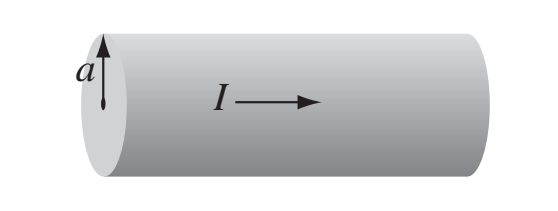

[Click here for a pdf of this page](secondexam.pdf)

The exam is available on this page from 6pm Saturday April 4, and will be due at midnight (local time zone) on
Saturday, April 11th.

Instructions: 
You may choose 3 contiguous hours to work on this exam.  You may use your notes, the book, and anything found at andrealommen.github.io/PHY309.  If you wish to take a 15-minute break during the exam (which I recommend) you may then take 3 hours and 15 minutes to work on the exam.

You may use Mathematica if you wish but you must follow the rules for making it readable.

Please scan your answers and submit them to the dropbox folder I will make available.  Do NOT count your time scanning and submitting as part of the 3 hours.

There are 4 problems.  

Please email me when you are starting the exam.

(You may either print this out or write this statement on your exam and sign
it.)

I accept full responsibility under the Haverford College Honor System for my conduct on the examination.

Signed____________________________________________________________________

Exam begins here:
-----------------------------------------------------------------------------

1.	(5 points) A steady current $$I$$ flows down a long cylindrical wire of radius a (See figure at the bottom of the page). Find the magnetic field, both inside and outside the wire, if 

	(a)	The current is uniformly distributed over the outside surface of the wire. 

	(b)	The current is distributed in such a way that $$\vec{J}$$ is proportional to 
$$s$$, the distance  from the axis. 

2.	(5 points) An infinitely long cylinder, of radius $$R$$, carries a “frozen-in” magnetization, parallel to the axis,  $$M = ks \hat{z}$$,  where $$k$$ is a constant and $$s$$ is the distance from the axis; there is no free current anywhere.

	(a) 	(4 points) Find the magnetic field $$\vec{B}$$ inside and outside the cylinder.
	
	(b)	(1 point) If you did the problem above using bound current, then check it using Ampere's law for auxiliary fields: $$\oint\vec{H}\cdot d\vec{l} = I_{free, enclosed}$$.  If you did the problem above using Ampere's law for auxiliary fields, then check it using bound current, i.e. $$\vec{J}_b = \nabla \times \vec{M}$$.

3.	(5 points)

	(a) (2 points) Suppose you imbedded some free charge in a piece of glass. About how long  would it take for the charge to flow to the surface?   For glass the index of refraction is typically around 1.5, so use $$n=1.5$$. The conductivity of glass varies widely but use $$10^{-12} (\Omega m)^{-1}$$ as a reasonable number.

	(b) (1 point) Comment on whether the time you got above makes sense to you.  And if you didn't get an answer, comment on what sort of time-scale would make sense to you.  For example, do you expect this number to be long or short compared to the amount of time that passes in between you turning on a switch and the light coming on? (Remember, the conductivity of glass is low.)  Do you expect it to be long or short compared to the age of the universe?

	(c) (2 points) Silver is an excellent conductor, but it’s expensive. Suppose you were designing a microwave experiment to operate at a frequency of 1010 Hz (that's $$\nu$$ not $$\omega$$). How thick would you make the silver coating on your experiment so that you didn't get cooked by your own experiment ?
For silver the conductivity $$\sigma = 6.25 \times 10^7 (\Omega m)^{-1}$$ and $$\epsilon \approx \epsilon_0$$.

4.	(5 points) This is a mini hodge-podge of questions about EM fields. The two parts
are independent and can be worked on separately.

	(a) Write down the equation for the E-field for a wave traveling in the $$+y$$ direction in a medium with $$\epsilon$$ and $$\mu$$, with amplitude $$E_0$$, frequency $$\omega$$, and with the polarization in the 
$$\hat{x}$$ direction.  Set the phase of the wave such that the E-field reaches
a maximum at the origin at $$t=0$$. Write down the equation for the B-field. Your
wave should be traveling at the proper velocity for that medium. 
Explain how you can check that you've gotten each of those
things right in your equations.  

	(b) If this wave encountered an interface you would match four
boundary conditions shown below.  Where did each one come from? (I don't want you to derive them unless you think that's easier than explaining where each one came from.  Your explanation should include one Maxwell's law and a brief description (a couple sentences) of the procedure for deriving the boundary condition.)  

$$
\epsilon_1E_1^\perp = \epsilon_2E_2^\perp  
$$

$$
B_1^\perp = B_2^\perp
$$

$$
\vec{E}_1^\| = \vec{E}_2^\|
$$

$$
\frac{1}{\mu_1}\vec{B}_1^\| =  \frac{1}{\mu_2}\vec{B}_2^\|  
$$ 

{:class="img-responsive"}]
